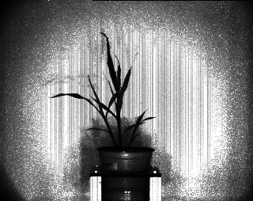

## Histogram Equalization

This is a method used to normalize the distribution of signal intensity values within an image. 
If the image has low contrast it will make it easier to threshold.

**plantcv.hist_equalization**(*gray_img*)

**returns** normalized image

- **Parameters:**
    - gray_img - Grayscale image data
- **Context:**
    - Used to normalize the distribution of a signal intensity within an image.

**Grayscale image**





```python
from plantcv import plantcv as pcv

# Set global debug behavior to None (default), "print" (to file), or "plot" (Jupyter Notebooks or X11)
pcv.params.debug = "print"

# Examine signal distribution within an image
# prints out an image histogram of signal within image
he_img = pcv.hist_equalization(gray_img)
```

**Normalized image**




