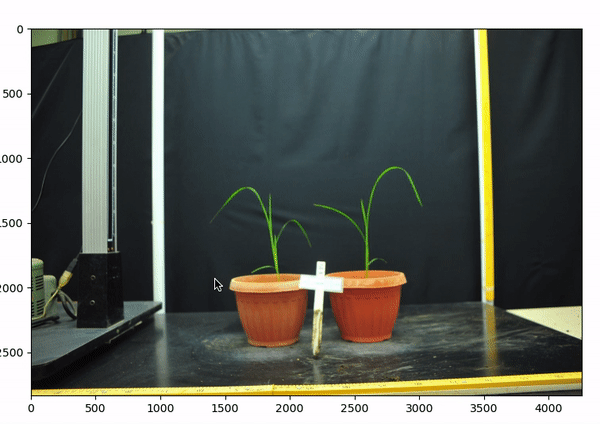
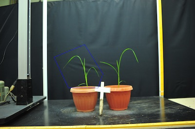

## Interactive Point Annotation Tool

Using [Jupyter Notebooks](jupyter.md) it is possible to interactively click to collect coordinates from an image, which can be used in various downstream applications. Left click on the image to collect a point. Right click removes the
closest collected point.

**plantcv.Points**(*img, figsize=(12, 6)*)

**returns** interactive image class

- **Parameters:**
    - img - Image data
    - figsize - Interactive plot figure size (default = (12,6))

- **Attributes:**
    - points - Coordinates (x,y) of the collected points as a list of tuples

- **Context:**
    - Used to define a list of coordinates of interest.
    - For example the [`pcv.roi.custom`](roi_custom.md) function defines a polygon Region of Interest based on a list of vertices, which can be labor intensive to define but is streamlined with the ability to click for point collection.
    - The list of vertices output has also shown to be helpful while using [pcv.roi.multi](roi_multi.md) in cases where centers are defined with a custom list of vertices.    
- **Example use:**
    - Below


```python
from plantcv import plantcv as pcv

# Create an instance of the Points class
marker = pcv.Points(img=img, figsize=(12,6))

# Click on the plotted image to collect coordinates

# Use the identified coordinates to create a custom polygon ROI
roi_contour, roi_hierarchy = pcv.roi.custom(img=img, vertices=marker.points)

```

**Selecting Coordinates**



**Resulting ROI**




**Source Code:** [Here](https://github.com/danforthcenter/plantcv/blob/master/plantcv/plantcv/classes.py)
