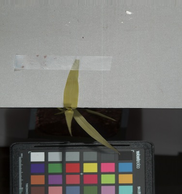

## class Spectral_data

A PlantCV data object class.

*class* plantcv.**Spectral_data**

`Spectral_data` is a class that is used to create instances of hyperspectral/multispectral data objects for PlantCV analysis. 
An instance of `Spectral_data` is created automatically as hyperspectral data is read in with [pcv.readimage](read_image.md). 
Functions from the PlantCV hyperspectral sub-package utilize the `plantcv.Spectral_data` instance attributes, which has metadata about the hyperspectral 
data instance, to simplify function input. Most of this metadata is collected from the .hdr file. 
These attributes are used internally by PlantCV functions but also can be utilized by users. 

### Attributes

Attributes are accessed as spectral_data_instance.*attribute*.

**array_data**: The actual data, stored as a Numpy array. 

**max_wavelength**: Largest available wavelength in the spectral datacube. 

**min_wavelength**: Smallest available wavelength in the spectral datacube. 

**d_type**: Data type of the Numpy array data 

**wavelength_dict**: The wavelength dictionary that gets created during [pcv.readimage](read_image.md) while `mode='envi'` since metadata is collected from the .hdr file 

**samples**: Width of a single band of spectral data, shaped (samples, lines) rather than (x,y) with other arrays.

**lines**: Length of a single band of spectral data, shaped (samples, lines) rather than (x,y) with other arrays.

**interleave**: Interleave type 

**wavelength_units**: Units of the wavelengths 

**array_type**: The type of array data (entire datacube, specific index, first derivative, etc)

**pseudo_rgb**: Psuedo-RGB image if the array_type is a datacube

**filename**: The filename where the data originated from

### Example

PlantCV functions from the hyperspectral sub-package use `Spectral_data` implicitly.

```python
from plantcv import plantcv as pcv


# Read in data
spectral_data_instance = pcv.readimage(filename="ee362e84-c861-4f0d-abbb-215ac58eed60_data")

index_array_gdvi = pcv.hyperspectral.extract_index(array=spectral_data_instance, 
                                                   index="GDVI",
                                                   distance=20)
                                                   
# Plot the pseudo-RGB image that is created when reading in hyperspectral data 
pcv.plot_image(spectral_data_instance.pseudo_rgb)

# Plot the index extracted from the hyperspectral datacube 
pcv.plot_image(index_array_gdvi.array_data)

print(str(spectral_data_instance.max_wavelength) + spectral_data_instance.wavelength_units)

```

*Psuedo-RGB image from hyperspectral datacube*



*GDVI Grayscale Image*


*Maximum wavelength*

```python
> 1000.95nm
```

**Source Code:** [Here](https://github.com/danforthcenter/plantcv/blob/master/plantcv/plantcv/classes.py)
