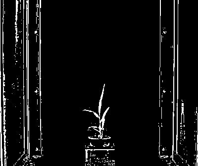

## Adaptive Threshold

Creates a binary image from a gray image using adaptive thresholding.

**plantcv.adaptive_threshold(*img, maxValue, thres_type, object_type, device, debug=None*)**

**returns** device, thresholded image

- **Parameters:**
    - img - grayscale img object
    - maxValue - value to apply above threshold (255 = white)
    - thres_type  = type of thresholding ('gaussian' or 'mean')
    - objecttype - 'light' or 'dark', is target image light or dark?
    - device- Counter for image processing steps
    - debug- None, "print", or "plot". Print = save to file, Plot = print to screen. Default = None
- **Context:**
    - Used to help differentiate plant and background
    

**Grayscale image (green-magenta channel)**


```python
from plantcv import plantcv as pcv

# Create binary image from a gray image based
device, threshold_gaussian = pcv.adaptive_threshold(img, 255, 'gaussian','dark', device, debug="print")
```

**Auto-Thresholded image (gaussian)**


```python
from plantcv import plantcv as pcv

# Create binary image from a gray image based 
device, threshold_mean = pcv.adaptive_threshold(img, 255, 'mean','dark', device, debug="print")
```

**Auto-Thresholded image (mean)**


