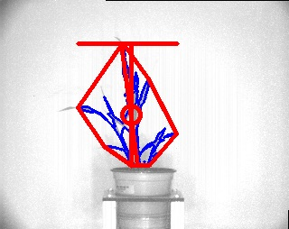

## Analyze NIR Intensity

This function calculates the intensity of each pixel associated with the plant and writes 
the values out to a file. Can also print out a histogram plot of pixel intensity.

**plantcv.analyze_nir_intensity**(*gray_img, mask, bins, histplot=False*)

**returns** header of histogram, histogram data, pseudocolored image

- **Parameters:**
    - gray_img - 8- or 16-bit grayscale image data
    - mask     - Binary mask made from selected contours
    - bins     - Number of class to divide spectrum into
    - histplot - If True plots histogram of intensity values (default histplot = False)
- **Context:**
    - Used to mask rectangular regions of an image
- **Example use:**
    - [Use In NIR Tutorial](nir_tutorial.md)
    
- **Output Data Units:**
    - Bins - bin values based on number of bins set by user  
    - Signal Histogram - histogram of object pixel intensity values 0 (unsaturated) to 255 (saturated)     

**Original grayscale image**


```python

from plantcv import plantcv as pcv

# Set global debug behavior to None (default), "print" (to file), or "plot" (Jupyter Notebooks or X11)

pcv.params.debug = "print"

# Caclulates the proportion of pixels that fall into a signal bin and writes the values to a file. Also provides a histogram of this data
hist_header, hist_data, nir_hist  = pcv.analyze_nir_intensity(gray_img, mask, 256, histplot=True)

# Plot the histogram
nir_hist
```


**NIR signal histogram**


**Image with shape characteristics**



**Note:** The grayscale input image and object mask can be used with the [pcv.pseudocolor](pseudocolor.md) function
which allows the user to pick a colormap for plotting.