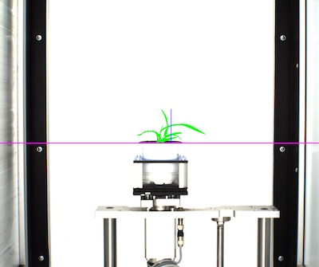
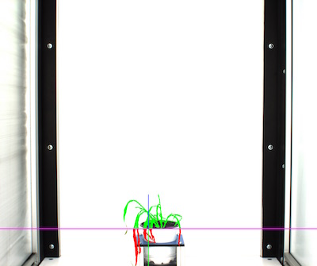

## Horizontal Boundary Line Tool

Set boundary line with boundary tool, this allows the user to find the extent-y ('height')
above and below as well as the area above and below the boundary line. This tool functions 
best if the pot size/position of the plant remains relatively constant.
 
**plantcv.analyze_bound_horizontal**(*img, obj, mask, line_position*)

**returns** boundary headers, boundary data, images with boundary data

- **Parameters:**
    - img - RGB or grayscale image data for plotting
    - obj - single or grouped contour object
    - mask - binary mask of selected contours
    - line_position = position of boundary line (a value of 0 would draw the line through the bottom of the image)
- **Context:**
    - Used to define a boundary line for the image, to find the height above and below as well as area above and below a boundary line.
    - Could also be used as a method of flagging images about to go out-of-bounds (this QC tool will be added later)
- **Example use:**
    - [Use In VIS Tutorial](vis_tutorial.md)

- **Output Data Units:**
    - Y-Position - Height of the bound line used for measurement (height from bottom of image), pixels (units)
    - Height-Above-Bound - Extent-y of object above bound line, pixels (units)
    - Height-Below-Bound - Extent-y of object below bound line, pixels (units)
    - Area-Above-Bound - area of object above bound line, pixels (units)
    - Area-Below-Bound - area of object below bound line, pixels (units)
    - Percent-Above-Bound - percentage of total area above the bound line
    - Percent-Below-Bound - percentage of total area below the bound line  

```python

from plantcv import plantcv as pcv

# Set global debug behavior to None (default), "print" (to file), or "plot" (Jupyter Notebooks or X11)
pcv.params.debug = "print"

# Set Boundary Line    
boundary_header, boundary_data, boundary_images = pcv.analyze_bound_horizontal(img, obj, mask, 950)
```

**Boundary tool output image (y = 950)**



Boundary line set at 950, purple line is boundary line, blue line is extent y above boundary line, 
green is area above boundary line.

**Boundary tool output image (y = 330)**



Boundary line set at 330, purple is boundary line, blue line is extent y above boundary line, 
green line is extent y below boundary line, green is area above boundary line and red is area below boundary line.
