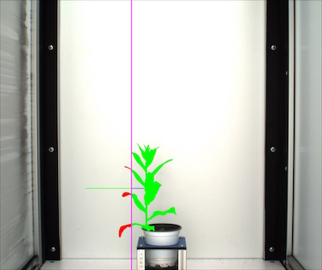
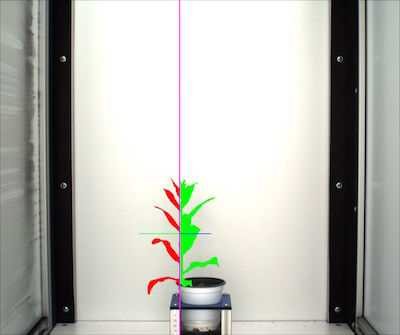

## Vertical Boundary Line Tool

Set boundary line with boundary tool, this allows the user to find the extent-x ('width')
to the right and to the left as well as the area to the right and to the left of the set boundary line. This tool functions 
best if the pot size/position of the plant remains relatively constant.
 
**analyze_bound_vertical**(*img, obj, mask, line_position, device , debug=None, filename=False*)

**returns** device, boundary headers, boundary data, image with boundary data

- **Parameters:**
    - img - image object (most likely the original), color(RGB)
    - imgname - name of image
    - obj - single or grouped contour object
    - mask - binary mask of selected contours
    - line_position = position of boundary line (a value of 0 would draw the line through the left of the image)
    - device - Counter for image processing steps
    - debug - None, "print", or "plot". Print = save to file, Plot = print to screen. Default = None
    - filename - False or image name. If defined print image
- **Context:**
    - Used to define a boundary line for the image, to find the width to the right and to the left as well as area to the right and to the left of a boundary line.
    - Could also be used as a method of flagging images about to go out-of-bounds
- **Example use:**
    - [Use of horizonal companion tool in In VIS Tutorial](vis_tutorial.md)

**Output Data Units:** 
    - X-Position - Position of the bound line used for measurement (from left side of image), pixels (units)  
    - Width-Left-Bound - Extent-x of object to the left of bound line, pixels (units)  
    - Width-Right-Bound - Extent-x of object to the right of bound line, pixels (units)  
    - Area-Left-Bound - area of object to the left of bound line, pixels (units)  
    - Area-Right-Bound - area of object to the right of bound line, pixels (units)  
    - Percent-left-Bound - percentage of total area left of the bound line  
    - Percent-Right-Bound - percentage of total area right of the bound line  

```python
from plantcv import plantcv as pcv

# Set Boundary Line    
device, boundary_header, boundary_data, boundary_img1 = pcv.analyze_bound_vertical(img, obj, mask, 1000, device, debug='print', 'setaria_boundary_img.png')
```

**Boundary tool output image (x = 1000)**



Boundary line set at 1000, purple line is boundary line, blue line is extent x right of the boundary line, 
green is area right of boundary line. Green line is extent x left of the boundary line and red is area left
of the boundary line.

**Boundary tool output image (x = 1100)**



Boundary line set at 1100, purple is boundary line, blue line is extent x right of the boundary line, 
green is area right of boundary line. Green line is extent x left of the boundary line and red is area left
of the boundary line.