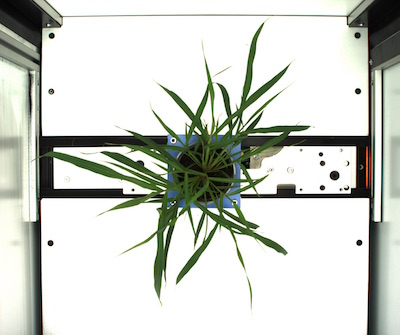
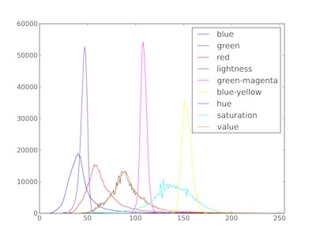
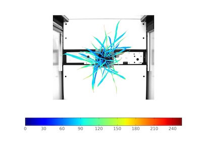

## Analyze Color

Extract color data of objects and produce pseudocolored images, can extract data for RGB (Red, Green, Blue), HSV (Hue, Saturation, Value) and LAB (Lightness, Green-Magenta, Blue Yellow) channels.

**plantcv.analyze_color**(*rgb_img, mask, bins, hist_plot_type=None*)

**returns** color channel histogram headers, color channel histogram data, analysis images  

- **Parameters:**  
    - rgb_img - RGB image data
    - mask - binary mask of selected contours
    - bins - number of color bins (0-256), if you would like to bin data, you would alter this number
    - hist_plot_type - None (default), 'all', 'rgb','lab' or 'hsv', this is the data to be printed to an SVG histogram file, however all (every channel) data is still stored to the database.
- **Context:**
    - Used to extract color data from RGB, LAB, and HSV color channels.
    - Generates histogram of color channel data.
- **Example use:**
    - [Use In VIS Tutorial](vis_tutorial.md)
 
- **Output Data Units:**  
    - Red Channel - histogram of object pixel intensity values 0 (unsaturated) to 255 (saturated)  
    - Green Channel - histogram of object pixel intensity values 0 (unsaturated) to 255 (saturated)  
    - Blue Channel - histogram of object pixel intensity values 0 (unsaturated) to 255 (saturated)  
    - Hue Channel - histogram of object pixel intensity values 0 (unsaturated) to 255 (saturated)  
    - Saturation Channel - histogram of object pixel intensity values 0 (unsaturated) to 255 (saturated)  
    - Value Channel - histogram of object pixel intensity values 0 (unsaturated) to 255 (saturated)  
    - Lightness Channel - histogram of object pixel intensity values 0 (unsaturated) to 255 (saturated)  
    - Green-Magenta Channel - histogram of object pixel intensity values 0 (unsaturated) to 255 (saturated)  
    - Blue-Yellow Channel - histogram of object pixel intensity values 0 (unsaturated) to 255 (saturated)  

**Original image**



```python

from plantcv import plantcv as pcv

# Set global debug behavior to None (default), "print" (to file), or "plot" (Jupyter Notebooks or X11)

pcv.params.debug = "print"

# Analyze Color
    
color_header, color_data, analysis_image = pcv.analyze_color(rgb_img, mask, 256, 'all')
```

**Histograms of (R, G, B), (H, S, V), and (L, A, B) color channels**



**Pseudocolored value-channel image**


