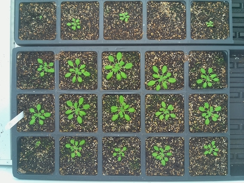
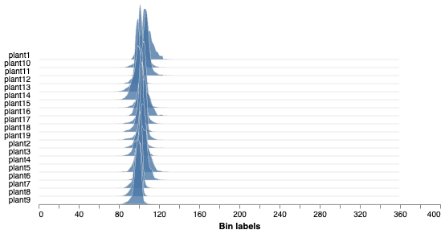

## Analyze Color

Extract color data of objects and produce a histogram. Data can be extracted for RGB (Red, Green, Blue),
HSV (Hue, Saturation, Value) and LAB (Lightness, Green-Magenta, Blue Yellow) channels.

**plantcv.analyze.color**(*rgb_img, labeled_mask, n_labels=1, colorspaces="hsv", label=None*)

**returns** Ridgeline plot of histograms of hue values   

- **Parameters:**  
    - rgb_img - RGB image data
    - labeled_mask - Labeled mask of objects (32-bit, output from [`pcv.create_labels`](create_labels.md) or [`pcv.roi.filter`](roi_filter.md)).
    - n_labels - Total number expected individual objects (default = 1).
    - colorspaces - 'all', 'rgb', 'lab', or 'hsv'. This can limit the data saved out (default = 'hsv'). 
    - label - Optional label parameter, modifies the variable name of observations recorded. (default = `pcv.params.sample_label`)
- **Context:**
    - Used to extract color data from RGB, LAB, and HSV color channels.
    - Generates histogram of color channel data. 
- **Example use:**
    - [Use In VIS Tutorial](tutorials/vis_tutorial.md)
- **Output data stored:**  Data ('blue_frequencies', 'green_frequencies', 'red_frequencies', 'lightness_frequencies', 'green-magenta_frequencies', 
    'blue-yellow_frequencies', 'hue_frequencies', 'saturation_frequencies', 'value_frequencies', 'hue_circular_mean', 'hue_circular_std', 'hue_median') 
    automatically gets stored to the [`Outputs` class](outputs.md) when this function is ran. 
    These data can always get accessed during a workflow (example below). For more detail about data output see [Summary of Output Observations](output_measurements.md#summary-of-output-observations)

**Original image**



```python

from plantcv import plantcv as pcv

# Set global debug behavior to None (default), "print" (to file), 
# or "plot" (Jupyter Notebooks or X11)

pcv.params.debug = "plot"
# Optionally, set a sample label name
pcv.params.sample_label = "plant"

# Analyze Color
analysis_image = pcv.analyze.color(rgb_img=rgb_img, labeled_mask=mask, n_labels=1, colorspaces='hsv')

# Access data stored out from analyze_color
hue_circular_mean = pcv.outputs.observations['plant1']['hue_circular_mean']['value']

```

**Histograms of hue values**



**Source Code:** [Here](https://github.com/danforthcenter/plantcv/blob/main/plantcv/plantcv/analyze/color.py)
