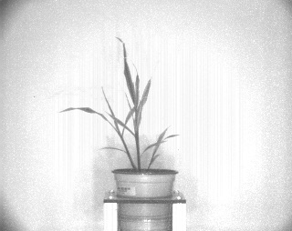

## Analyze grayscale values

This function calculates the intensity of each pixel associated with the plant and writes 
the values out to the [Outputs class](outputs.md). Can also return/plot/print out a histogram plot of pixel intensity.

**plantcv.analyze.grayscale**(*gray_img, labeled_mask, n_labels=1, bins=100, label=None*)

**returns** Histogram image

- **Parameters:**
    - gray_img - 8- or 16-bit grayscale image data.
    - labeled_mask - Labeled mask of objects (32-bit).
    - n_labels - Total number expected individual objects (default = 1).
    - bins     - Number of histogram bins (default = 100)
    - label - Optional label parameter, modifies the variable name of observations recorded. (default = `pcv.params.sample_label`)
- **Context:**
    - Grayscale pixel values within a masked area of an image. 
- **Example use:**
    * [Grayscale Image Tutorial](tutorials/grayscale_tutorial.md)

- **Output data stored:** Data ('gray_frequencies', 'gray_mean', 'gray_median', 'nir_stdev') automatically gets stored to
the [`Outputs` class](outputs.md) when this function is ran. These data can always get accessed during a workflow (example
below). For more detail about data output see [Summary of Output Observations](output_measurements.md#summary-of-output-observations)

**Original grayscale image**



```python

from plantcv import plantcv as pcv

# Set global debug behavior to None (default), "print" (to file), 
# or "plot" (Jupyter Notebooks or X11)

pcv.params.debug = "plot"
# Optionally, set a sample label name
pcv.params.sample_label = "plant"

# Caclulates the proportion of pixels that fall into a signal bin and writes the values to a file.
# Also provides a histogram of this data
analysis_image  = pcv.analyze.grayscale(gray_img=gray_img, labeled_mask=mask, n_labels=1, bins=100)

# Access data stored out from analyze.grayscale
nir_frequencies = pcv.outputs.observations['plant1']['gray_frequencies']['value']

```


**Near-infrared signal histogram**


**Source Code:** [Here](https://github.com/danforthcenter/plantcv/blob/main/plantcv/plantcv/analyze/grayscale.py)
