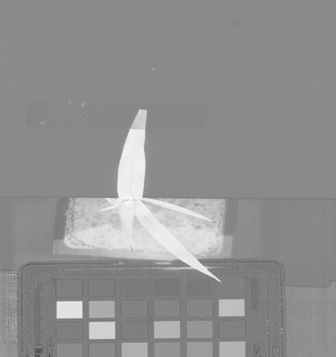
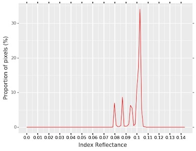

## Analyze a Spectral Index

This function calculates the spectral index statistics and writes the values as observations out to the 
[Outputs class](outputs.md).
       
**plantcv.hyperspectral.analyze_index**(*index_array, mask, histplot=False, bins=100, min_bin=0, max_bin=1, label="default"*)

**returns** None

- **Parameters:**
    - index_array   - instance of the `Spectral_data` class (created by running [pcv.spectral_index](spectral_index.md))
    - mask          - Binary mask made from selected contours
    - histplot      - If True plots histogram of intensity values
    - bins          - Optional, number of classes to divide spectrum into (default bins=100) 
    - min_bin       - Optional, minimum bin label. Default of 0 will be used for the smallest bin label while calculating pixel frequency data unless otherwise defined. 
                      `min_bin="auto"` will set minimum bin to the smallest observed pixel value within the masked index provided.
    - max_bin       - Optional, maximum bin label. Default of 1 will be used for the maximum bin label unless otherwise defined. `max_bin="auto"` will set maximum bin to the largest observed pixel value within the masked index provided.
    - label         - Optional label parameter, modifies the variable name of observations recorded 

- **Context:**
    - Calculates data about mean, median, and standard deviation of an input index within a masked region. 
    - If using an index that is expected to have negative values after masking (i.e. PRI) the default `min_bin=0` will cut off pixel frequency data at 0 unless adjusted. 
- **Example use:**
    - Below
- **Output data stored:** Mean, median, and standard deviation of the index automatically gets stored to the 
    [`Outputs` class](outputs.md) when this function is ran. 
    These data can always get accessed during a workflow. For more detail about data output see [Summary of Output Observations](output_measurements.md#summary-of-output-observations)


```python

from plantcv import plantcv as pcv

pcv.hyperspectral.analyze_index(index_array=ndvi_index, mask=leaf_mask, histplot=True, bins=100, min_bin=0, max_bin="auto", label="default")

```

*NDVI Index Image* 




*Masked Index Histogram*



**Source Code:** [Here](https://github.com/danforthcenter/plantcv/blob/master/plantcv/plantcv/hyperspectral/analyze_index.py)
