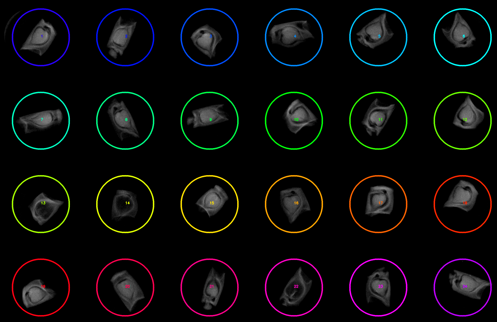
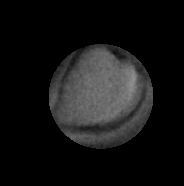

## Analyze radial percentile

This function calculates the average value of pixels within a cutoff threshold from the center of an object and writes 
the values out to the [Outputs class](outputs.md).  


**plantcv.analyze.radial_percentile**(*img, mask, roi=None, percentile=50, label=None*)

**returns** List of average values for either grayscale or RGB

- **Parameters:**
    - img - RGB or grayscale image.
    - mask - Binary mask.
    - roi - Optional ROIs for calculating on multiple objects in an image.
    - percentile - cutoff for considering pixels in the average. Expressed as a percent of maximum distance from the object's center (default = 50).
    - label - Optional label parameter, modifies the variable name of observations recorded. Can be a prefix or list (default = pcv.params.sample_label).
- **Outputs:**
    - A list of average values for RGB or gray channels for each object (if ROIs are provided), or for the single object in the image. 
- **Example use:**
    - Useful for calculating the intensity of the middle of seeds from an X-ray image.
    - Also could be useful in determining if there are color differences in the middle of a plant rosette. 

- **Output data stored:** Data ('gray_X%_avg', or 'red_X%_avg', 'green_X%_avg', 'blue_X%_avg') automatically gets stored to
the [`Outputs` class](outputs.md) when this function is ran. These data can always get accessed during a workflow (example
below). For more detail about data output see [Summary of Output Observations](output_measurements.md#summary-of-output-observations)

**Multi-ROI object on original image**



```python

from plantcv import plantcv as pcv

# Caclulates the average values of pixels that fall within the distance percentile from the center of an object.
list_of_averages  = pcv.analyze.radial_percentile(img=img, mask=mask, roi=rois, percentile=40)

# Access data stored out from analyze.radial_percentile
gray_avg_seed1 = pcv.outputs.observations['default_1']['gray_40%_avg']['value']

```


**Debug depicting one example of seed cropped to 40% of maximum distance from center**



**Source Code:** [Here](https://github.com/danforthcenter/plantcv/blob/main/plantcv/plantcv/analyze/radial.py)
