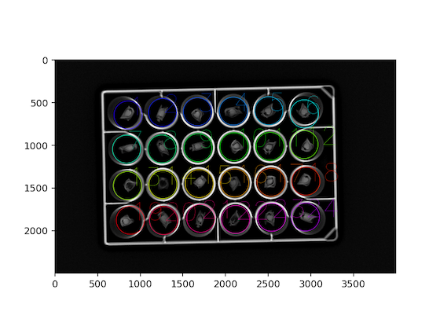
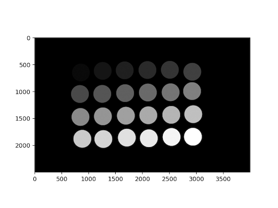
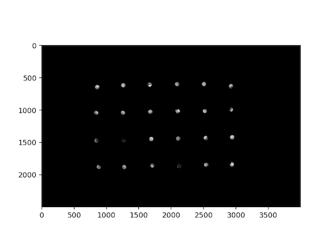

## Analyze radial percentile

This function calculates the average value of pixels within a cutoff threshold from the center of an object and writes 
the values out to the [Outputs class](outputs.md).  


**plantcv.analyze.radial_percentile**(*img, labeled_mask, n_labels=1, percentile=50, label=None*)

**returns** List of average values for either grayscale or RGB

- **Parameters:**
    - img - RGB or grayscale image.
    - labeled_mask - Labeled mask of objects (32-bit), or a binary mask of a single object.
    - n_labels - Total number expected individual objects (default = 1).
    - percentile - cutoff for considering pixels in the average. Expressed as a percent of maximum distance from the object's center (default = 50).
    - label - Optional label parameter, modifies the variable name of observations recorded. Can be a prefix or list (default = pcv.params.sample_label).
- **Outputs:**
    - A list of average values for RGB or gray channels for each labeled object. Only object pixels (not background) within the cutoff are averaged. Objects that are empty, or have no pixels within the cutoff, return NaN and no observations are recorded for them.
- **Example use:**
    - Useful for calculating the intensity of the middle of seeds from an X-ray image.
    - Also could be useful in determining if there are color differences in the middle of a plant rosette. 

- **Output data stored:** Data ('gray_X%_avg', or 'red_X%_avg', 'green_X%_avg', 'blue_X%_avg') automatically gets stored to
the [`Outputs` class](outputs.md) when this function is ran. These data can always get accessed during a workflow (example
below). For more detail about data output see [Summary of Output Observations](output_measurements.md#summary-of-output-observations)

**Labeled objects on original image**


```python

import numpy as np
labeled_mask = pcv.roi.roi2mask(img=crop_img, roi=rois1)

# Calculates the average values of pixels that fall within the distance percentile from the center of an object.

rois1 = pcv.roi.auto_wells(gray_img=crop_img, mindist = 100, candec = 50, 
accthresh = 60, minradius = 100, maxradius = 180, nrows=4, ncols=6, radiusadjust=-10)

```


```python

# Create a labeled mask with one label per well, e.g. from multiple ROIs
labeled_mask = pcv.roi.roi2mask(img=crop_img, roi=rois1)
number_mask = len(np.unique(labeled_mask))-1

```



```python

list_of_averages = pcv.analyze.radial_percentile(img=img, labeled_mask=labeled_mask, n_labels=number_mask, percentile=20)

# Access data stored out from analyze.radial_percentile
gray_avg_seed1 = pcv.outputs.observations['default_1']['gray_20%_avg']['value']

```

**Debug depicting the pixels of each seed within 20% of the maximum distance from its center**



**Source Code:** [Here](https://github.com/danforthcenter/plantcv/blob/main/plantcv/plantcv/analyze/radial.py)
