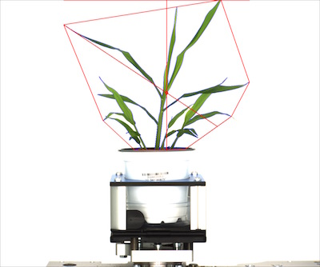

## Analyze Shape Characteristics of Object

Shape analysis outputs numeric properties for an input object (contour or grouped contours), works best on grouped contours.
 
**plantcv.analyze_object**(*img, obj, mask*)

**returns** shape data headers, shape data, analysis_images

- **Parameters:**
    - img - RGB or grayscale image data for plotting.
    - obj - Single or grouped contour object.
    - mask - Binary image to use as mask for moments analysis.
- **Context:**
    - Used to output shape characteristics of an image, including height, object area, convex hull, convex hull area, perimeter, extent x, extent y, longest axis, centroid x coordinate, centroid y coordinate, in bounds QC (if object touches edge of image, image is flagged). 
- **Example use:**
    - [Use In VIS Tutorial](vis_tutorial.md)
    - [Use In NIR Tutorial](nir_tutorial.md)
    - [Use In PSII Tutorial](psII_tutorial.md)

    
- **Output Data Units:**
    - Object Area - object area, pixels (units)
    - Convex-Hull Area - area of convex-hull, pixels (units)
    - Solidity - Ratio, object area divided by convex hull area.
    - Object Perimeter Length - pixels (units)
    - Object Width (extent x) - pixels (units)
    - Object Height (extent y) - pixels (units)
    - Longest Axis - pixels (units)
    - Center of Mass-X - x-coordinate, pixels (units)
    - Center of Mass-Y - y-coordinate, pixels (units)
    - Hull Vertices - number of convex-hull vertices
    - In Bounds - True or False (if False the object is touching top of image)
    - Object Bounding Ellipse Center-X - x-coordinate, pixels (units)
    - Object Bounding Ellipse Center-Y - y-coordinate, pixels (units)
    - Object Bounding Ellipse Major Axis - length of major axis of bounding ellipse, pixels (units)
    - Object Bounding Ellipse Minor Axis - length of minor axis of bounding ellipse, pixels (units)
    - Object Bounding Ellipse Angle - rotation of ellipse in degrees
    - Object Bounding Ellipse Eccentricity - ratio, 'roundness' of object (a perfect circle is 0, ellipse is greater than 0 but less than 1)  
    
**Original image**


```python

from plantcv import plantcv as pcv

# Set global debug behavior to None (default), "print" (to file), or "plot" (Jupyter Notebooks or X11)

pcv.params.debug = "print"

# Characterize object shapes
    
shape_header, shape_data, shape_images = pcv.analyze_object(img, objects, mask)

# Save returned images with more specific naming
shape_image, mask = shape_images
pcv.print_image(shape_image, '/home/malia/setaria_shape_img.png')
```

**Image with identified objects**


**Image with shape characteristics**


