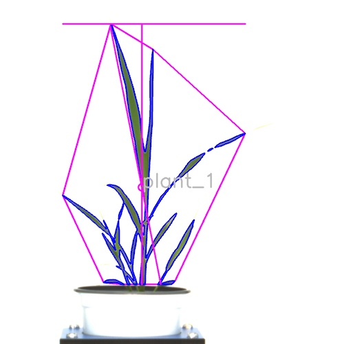

## Analyze the Size and Shape Characteristics of Objects

Size and shape analysis outputs numeric properties for individual plants, seeds, leaves, etc.
 
**plantcv.analyze.size**(*img, labeled_mask, n_labels=1, label=None*)

**returns** analysis_image

- **Parameters:**
    - img - RGB or grayscale image data for plotting.
    - labeled_mask - Labeled mask of objects (32-bit, output from [`pcv.create_labels`](create_labels.md) or [`pcv.roi.filter`](roi_filter.md)).
    - n_labels - Total number expected individual objects (default = 1).
    - label - Optional label parameter, modifies the variable name of observations recorded. Can be a prefix or list (default = pcv.params.sample_label).
- **Context:**
    - Used to output size and shape characteristics of individual objects (labeled regions). 
    - About the analysis image: We draw some of the measured shape characteristics on the input `img`. The height, width,
    longest path, convex hull, and centroid are drawn in magenta. The edges of the object is drawn in blue. When `pcv.params.verbose = True` then the `label` for a given object will also get drawn. Line thickness,
    text size, and text thickness are customizable attributes of [`pcv.params`](params.md). 
- **Example use:**
    - [Use In Seed Analysis Tutorial](https://plantcv.org/tutorials/seed-analysis-workflow)
- **Output data stored:** Data ('area', 'convex_hull_area', 'solidity', 'perimeter', 'width', 'height', 'longest_path',
'center_of_mass_x', 'center_of_mass_y', 'convex_hull_vertices', 'object_in_frame', 'ellipse_center_x', 'ellipse_center_y', 'ellipse_major_axis', 'ellipse_minor_axis',
'ellipse_angle', 'ellipse_eccentricity', 'total_edge_length') automatically gets stored to the [`Outputs` class](outputs.md) when this function is
run. These data can be accessed during a workflow (example below). Length and area type measurements can be scaled to real world units (e.g. mm and mm<sup>2</sup> using the `unit`, `px_height`, and `px_width` [parameters](params.md). For more detail about data output see
[Summary of Output Observations](output_measurements.md#summary-of-output-observations)
    
**Original image**


```python

from plantcv import plantcv as pcv

# Set global debug behavior to None (default), "print" (to file), 
# or "plot" (Jupyter Notebooks or X11)

pcv.params.debug = "plot"
# Optionally, set a sample label name
pcv.params.sample_label = "plant"

# Characterize object shapes
shape_image = pcv.analyze.size(img=img, labeled_mask=mask, n_labels=1)

# Save returned images with more specific naming
pcv.print_image(shape_image, '/home/malia/setaria_shape_img.png')

# Access data stored out from analyze.size
plant_solidity = pcv.outputs.observations['plant_1']['solidity']['value']

```

**Image with shape characteristics**



**Source Code:** [Here](https://github.com/danforthcenter/plantcv/blob/main/plantcv/plantcv/analyze/size.py)
