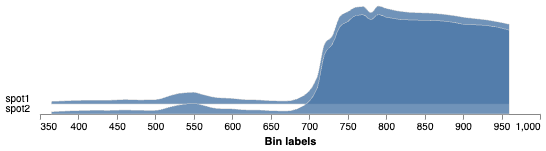

## Analyze Spectral Reflectance 

This function analyzes the reflectance values across the wavelengths measured by the input multi/hyperspectral datacube.

**plantcv.analyze.spectral_reflectance**(*hsi, labeled_mask, n_labels=1, label=None*)

**returns** reflectance plot

- **Parameters:**
    - hsi           - A hyperspectral datacube object, an instance of the `Spectral_data` class (read in with [pcv.readimage](read_image.md) with `mode='envi'`)
    - labeled_mask  - Labeled mask of objects (32-bit).
    - n_labels      - Total number expected individual objects (default = 1).
    - label         - Optional label parameter, modifies the variable name of observations recorded. (default = `pcv.params.sample_label`)
- **Example use:**
    - Below 
- **Output data stored:** Data ('global_mean_reflectance', 'global_median_reflectance', 'global_spectral_std', 'wavelength_means', 'max_reflectance', 
    'min_reflectance', 'spectral_std', 'spectral_frequencies') automatically gets stored to the 
    [`Outputs` class](outputs.md) when this function is ran. 
    These data can always get accessed during a workflow (example below). For more detail about data output see [Summary of Output Observations](output_measurements.md#summary-of-output-observations)

```python

from plantcv import plantcv as pcv

# Set global debug behavior to None (default), "print" (to file), 
# or "plot" (Jupyter Notebooks or X11)

pcv.params.debug = "plot"
# Optionally, set a sample label name
pcv.params.sample_label = "spot"

# Calculates reflectance values and saves the data as observations. Also provides a histogram of this data
spectral_hist  = pcv.analyze.spectral_reflectance(hsi=spectral_data, labeled_mask=mask, n_labels=2)

```

**Spectral Reflectance Intensity Histogram**



**Source Code:** [Here](https://github.com/danforthcenter/plantcv/blob/main/plantcv/plantcv/analyze/spectral_reflectance.py)
