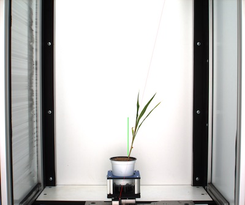
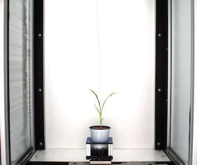

## Analyze Stem Objects

Primary, or stem, objects identified during workflows that examine the [morphology](tutorials/morphology_tutorial.md) of 
plants or plant organs can have specific characteristics measured about the stem segments of a skeleton.

**plantcv.morphology.analyze_stem**(*rgb_img, stem_objects, label="default"*)

**returns** labeled_img

- **Parameters:**
    - rgb_img      - RGB image data for plotting.
    - stem_objects - List of stem segments (output from [segment_sort](segment_sort.md) function)
    - label        - Optional label parameter, modifies the variable name of observations recorded 
- **Context:**
    - Used to output stem morphological characteristics, including height, angle, and length.
- **Example use:**
    - [Use In Morphology Tutorial](tutorials/morphology_tutorial.md)


- **Output data stored:** Data ('stem_angle', 'stem_height', and 'stem_length') 
    automatically gets stored to the [`Outputs` class](outputs.md) when this function is ran. 
    All data stored in the Outputs class gets printed out while running [print_results](print_results.md) but
    these data can always get accessed during a workflow. For more detail about data output see 
    [Summary of Output Observations](output_measurements.md#summary-of-output-observations)
    
```python

from plantcv import plantcv as pcv

# Set global debug behavior to None (default), "print" (to file), 
# or "plot" (Jupyter Notebooks or X11)

pcv.params.debug = "print"
    
stem_debug_img1 = pcv.morphology.analyze_stem(rgb_img=img1, stem_objects=stem_objects1, label="default")
# Access data stored out from analyze_object
stem_angle = pcv.outputs.observations['default']['stem_angle']['value']

stem_debug_img2 = pcv.morphology.analyze_stem(rgb_img=img2, stem_objects=stem_objects2, label="rep1")
stem_angle = pcv.outputs.observations['rep1']['stem_angle']['value']

```

**Image 1 with identified stem characteristics**



**Image 2 with identified stem characteristics**



**Source Code:** [Here](https://github.com/danforthcenter/plantcv/blob/master/plantcv/plantcv/morphology/analyze_stem.py)
