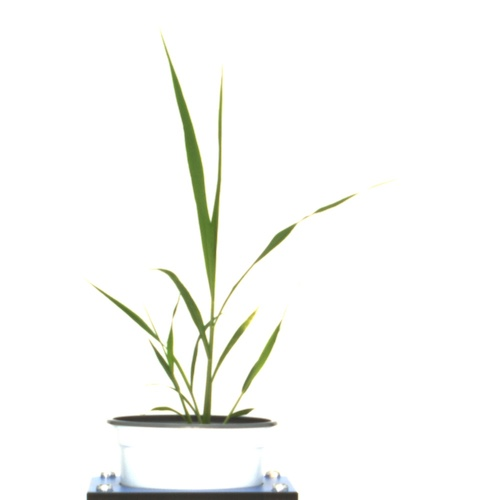
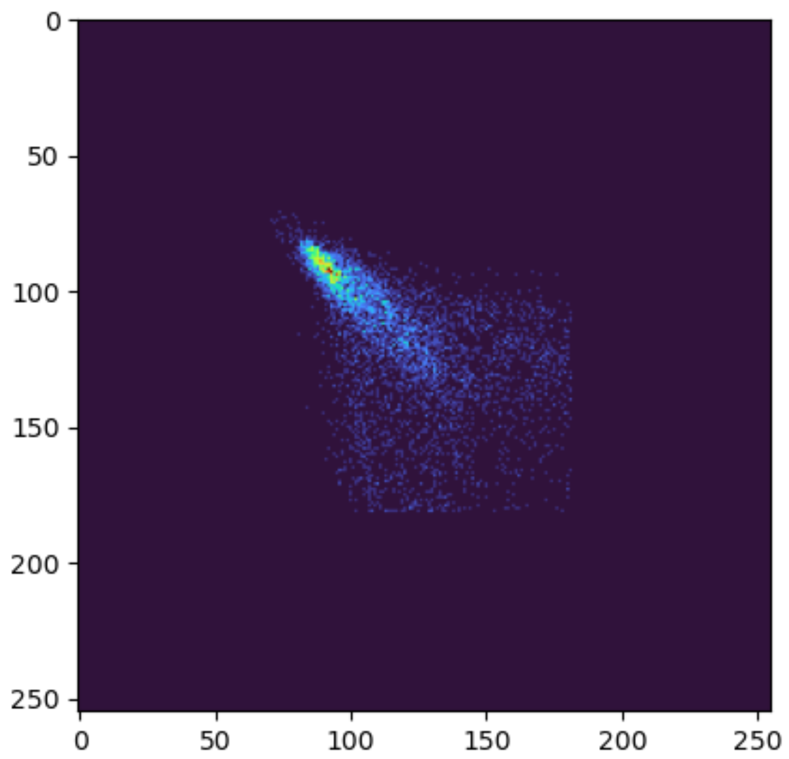

## Analyze the Texture Characteristics of Objects

Texture analysis outputs numeric properties for individual plants, seeds, leaves, etc.
 
**plantcv.analyze.texture**(*img, labeled_mask, methods=None, distances=None, angles=None,
                            levels=None, symmetric=False, normalize=False, n_labels=1, label=None*)

**returns** analysis_image

- **Parameters:**
    - img - Grayscale image data for plotting. If img has multiple channels it will be coerced to grayscale.
    - labeled_mask - Labeled mask of objects (32-bit, output from [`pcv.create_labels`](create_labels.md) or [`pcv.roi.filter`](roi_filter.md)).
	- methods - A list of texture phenotypes to return. If None (the default) then the entire list of possible methods is used (`["contrast", "dissimilarity", "homogeneity", "ASM", "energy", "correlation", "mean", "variance", "std", "entropy"]`)
	- distances - A list of distances between pixels to use, defaults to None which will use `[1]` to only compare adjacent pixels.
	- angles - A list of angles between pixels to compare, defaults to None, which will use `[0]`.
	- levels - Optionally an integer representing the number of grayscale values possible in the data, if left None (the default) then it is inferred from the image. For non-8-bit images it may be useful to bin the image instead.
	- symmetric - Logical, Should the order of values pairs be ignored? The default, False, will not always have [i, j] in the gray co-occurence matrix equal to [j, i] and will calculate both values.
	- normalize - Logical, should the matrix be rescaled to sum to 1? Defaults to False.
    - n_labels - Total number expected individual objects (default = 1).
    - label - Optional label parameter, modifies the variable name of observations recorded. Can be a prefix or list (default = pcv.params.sample_label).

- **Context:**
    - Used to output texture characteristics of individual objects (labeled regions). 
    - About the analysis image: The analysis image is less obvious than for [analyze.size](analyze_size.md) because phenotypes are calculated based on the co-occurence matrix rather than the raw image. The final co-occurence matrix is returned as a debug image with the first row/column removed to show changes within the object more clearly instead of from the empty area to the object.

- **Example use:**
    - [Use In Seed Analysis Tutorial](https://plantcv.org/tutorials/seed-analysis-workflow)

- **Output data stored:** Data including any of ("contrast", "dissimilarity", "homogeneity", "ASM", "energy", "correlation", "mean", "variance", "std", "entropy") automatically are stored to the [`Outputs` class](outputs.md) when this function is
run. These data can be accessed during a workflow (example below). For more detail about data output see
[Summary of Output Observations](output_measurements.md#summary-of-output-observations)

**Original image**



```python

from plantcv import plantcv as pcv

# Set global debug behavior to None (default), "print" (to file), 
# or "plot" (Jupyter Notebooks or X11)

pcv.params.debug = "plot"

# Characterize object texture from 3rd Channel Grayscale image
glcm = pcv.analyze.texture(img=img[:,:,2], labeled_mask=mask)

# Access data stored out from analyze.texture
plant_contrast = pcv.outputs.observations['default_1']['contrast']['value']

```

**Gray Level Co-Occurence Matrix**



**Source Code:** [Here](https://github.com/danforthcenter/plantcv/blob/main/plantcv/plantcv/analyze/texture.py)
