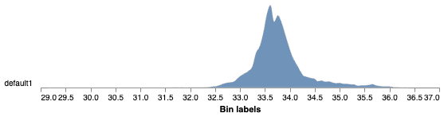

## Analyze Temperatures

This function calculates the temperature of each pixel and stores summary statistics and the distribution of temperature values.

**plantcv.analyze.thermal**(*thermal_img, labeled_mask, n_labels=1, bins=100, label=None*)

**returns** temperature histogram

- **Parameters:**
    - thermal_img - Numpy array of thermal image data (most likely read in with [pcv.readimage](read_image.md) with `mode='csv'`)
    - labeled_mask - Labeled mask of objects (32-bit, output from [`pcv.create_labels`](create_labels.md) or [`pcv.roi.filter`](roi_filter.md)).
    - n_labels - Total number expected individual objects (default = 1).
    - bins     - Number of histogram bins (default = 100)
    - label - Optional label parameter, modifies the variable name of observations recorded. (default = `pcv.params.sample_label`)
- **Context:**
    - Data about image temperature within a masked region. 
- **Example use:**
    - [](https://mybinder.org/v2/gh/danforthcenter/plantcv-tutorial-thermal/HEAD?labpath=index.ipynb)
    - Below
- **Output data stored:** Data ('max_temp', 'min_temp', 'mean_temp', 'median_temp', 'thermal_frequencies') automatically gets stored to the 
    [`Outputs` class](outputs.md) when this function is ran. 
    These data can always get accessed during a workflow (example below). For more detail about data output see [Summary of Output Observations](output_measurements.md#summary-of-output-observations)

**Original thermal array image**


```python

from plantcv import plantcv as pcv

# Set global debug behavior to None (default), "print" (to file), 
# or "plot" (Jupyter Notebooks or X11)

pcv.params.debug = "plot"
# Optionally, set a sample label name
pcv.params.sample_label = "plant"

# Caclulates the proportion of pixels that fall into a signal bin and writes the values to a file. Also provides a histogram of this data
thermal_hist  = pcv.analyze.thermal(thermal_img=thermal_img, labeled_mask=mask)

# Access data stored out from analyze.thermal
temp_range = pcv.outputs.observations['plant1']['max_temp']['value'] - pcv.outputs.observations['plant1']['min_temp']['value']

```


**Thermal Frequency histogram**



!!!Note
    A grayscale input image and object mask can be used with the [pcv.visualize.pseudocolor](visualize_pseudocolor.md) function
    which allows the user to pick a colormap for plotting.

```python

# Pseudocolor the thermal 
pseudocolor_img  = pcv.visualize.pseudocolor(thermal_img, min_value=31, max_value=35, mask=mask)

```


**Source Code:** [Here](https://github.com/danforthcenter/plantcv/blob/main/plantcv/plantcv/analyze/thermal.py)
