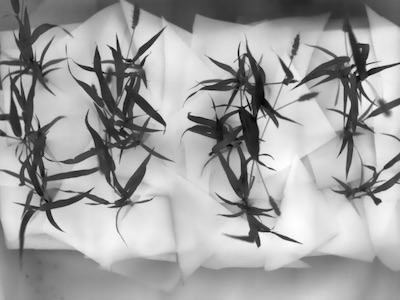
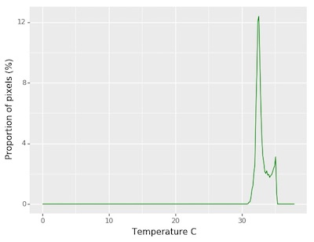
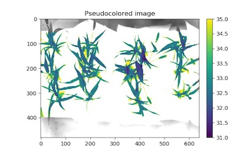

## Analyze Thermal Values 

This function calculates the intensity of each pixel associated with the temperature and writes 
the values out to a file. Can optionally create a histogram of pixel intensity.

**plantcv.analyze_thermal_values**(*thermal_array, mask, histplot=False, label="default""default"*)

**returns** thermal histogram (if `histplot=True`, otherwise returns None object)

- **Parameters:**
    - thermal_array - Numpy array of thermal image data (most likely read in with [pcv.readimage](read_image.md) with `mode='csv'`)
    - mask          - Binary mask made from selected contours
    - histplot      - If True plots histogram of intensity values (default histplot = False)
    - label - Optional label parameter, modifies the variable name of observations recorded. (default `label="default"`)
- **Context:**
    - Data about image temperature within a masked region. 
- **Example use:**
    - Below
- **Output data stored:** Data ('max_temp', 'min_temp', 'mean_temp', 'median_temp', 'thermal_frequencies') automatically gets stored to the 
    [`Outputs` class](outputs.md) when this function is ran. 
    These data can always get accessed during a workflow (example below). For more detail about data output see [Summary of Output Observations](output_measurements.md#summary-of-output-observations)

**Original thermal array image**



```python

from plantcv import plantcv as pcv

# Set global debug behavior to None (default), "print" (to file), 
# or "plot" (Jupyter Notebooks or X11)

pcv.params.debug = "print"

# Caclulates the proportion of pixels that fall into a signal bin and writes the values to a file. Also provides a histogram of this data
thermal_hist  = pcv.analyze_thermal_values(thermal_array=thermal_img, maks=mask, histplot=True, label="default")

# Access data stored out from analyze_thermal_values
temp_range = pcv.outputs.observations['default']['max_temp']['value'] - pcv.outputs.observations['default']['min_temp']['value']

```


**Thermal Frequency histogram**



**Note:** A grayscale input image and object mask can be used with the [pcv.visualize.pseudocolor](visualize_pseudocolor.md) function
which allows the user to pick a colormap for plotting.

```python

# Pseudocolor the thermal 
pseudocolor_img  = pcv.visualize.pseudocolor(thermal_img, min_value=31, max_value=35, mask=mask)

```



**Source Code:** [Here](https://github.com/danforthcenter/plantcv/blob/main/plantcv/plantcv/analyze_thermal_values.py)
