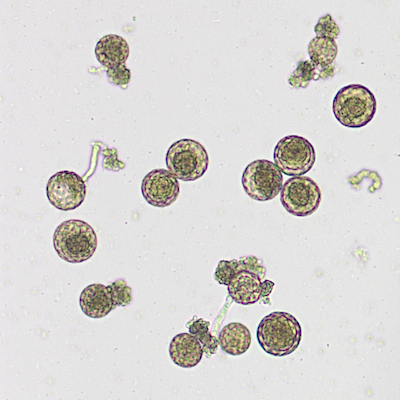
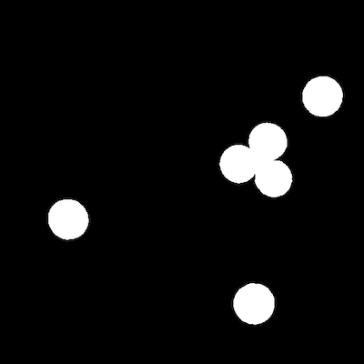
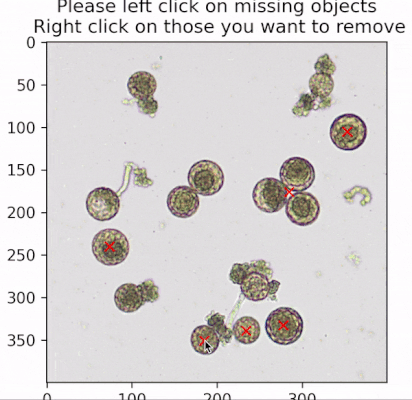
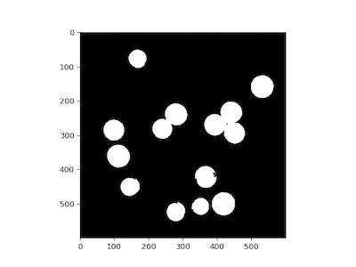
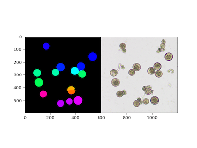
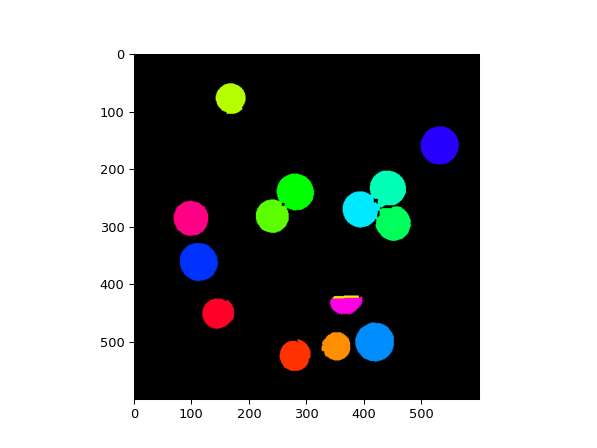
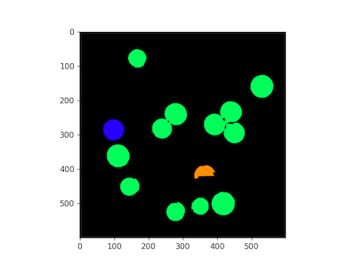
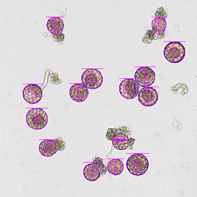

## Click and count objects 

`ClickCount` is a class that allows users to interactively count objects and other annotation tasks.

*class* **plantcv.annotate.ClickCount**(*img*, *figsize*=(12, 6))

- img - Image data
- figsize - Interactive plot figure size (default = (12,6))

### Attributes
**img**: input image.

**points**: a dictionary of coordinates for every class.

**colors**: a dictionary of colors for every class.

**counts**: a dictionary of count for every class.

**figsize**: figure size.

**events**: a list of events.

**label**: current label.

**color**: current color.

**view_all**: a flag indicating whether or not view all labels.

**fig**: matplotlib figure.

**ax**: matplotlib axis.

**p_not_current**: a list of matplotlib patches that are not current label.

---
### Methods
---
**view(*label*="total", *color*="c", *view_all*=False)**

View marked image, and update markers/annotations if needed.

- Parameters:
    - label - class label to show on the marked image. By default `label="total`.
    - color - desired color to show the class. By default `color="c"`.
    - view_all - a flag indicating whether to show markers for all classes or not. 
---
**import_coords(*coords*, *label*="total")**

Import coordinates from a list of coordinates.

- Parameters:
    - coords - a list of available coordintes.
    - label - class label for imported coordinates. By default `label="total`.
---
**file_import**(*filename*)

Import coordinates from file to a ClickCount object instance

- **Parameters:**
    - filename - path to a coordinates file  
- **Context:**
    - Loads coordinates from a file (probably created with the `.save_coords` method) to ClickCount object instance
---
**save_coords(*filename*)**

Save the collected coordinates to a JSON file.

- Parameters:
    - filename - (json) file name to save the coordinates of collected points. 
---
**correct**(*bin_img*, *bin_img_recover*, *coords*)

Make corrections to annotations 

**returns** recovered image

- **Parameters:**
    - bin_img - binary image, image with selected objects (e.g. mask output of [`pcv.annotate.detect_discs`](annotate_detect_discs.md))
    - bin_img_recover - binary image, image with all potential objects (binary image to recover objects from)  
    - coords - list of coordinates of 'auto' detected points (e.g. coordinate output of `pcv.annotate.detect_discs`)
- **Context:**
    - Make corrections to the number of objects in a binary image with information from the ClickCount class object instance (both remove and recover objects). Also corrects the ClickCount object instance with coordinates at the center of each object (rather than click location).
---
**create_labels**(*gray_img*, *label='default'*)

Label ClickCount Objects after they have been segmented 

**returns** labeled object image, labeled class image, ordered list of names, number of objects

- **Parameters:**
    - gray_img - gray image with objects uniquely labeled (e.g. output of [pcv.watershed_segmentation](watershed.md))
    - label - option to put in list of labels, defaults to 'default' if not included
- **Context:**
    - Labels each object with a class ID (e.g. germinated, and/or total) that matches classes from ClickCount, returns a list of names for input into analyze steps, renumbers objects to equal the total number of objects, and stores coordinates to `Outputs`. 
- **Output data stored:** Data ('count') for each ClickCount category automatically gets stored to the [`Outputs` class](outputs.md) when this function is
run. These data can be accessed during a workflow (example below). For more detail about data output see
[Summary of Output Observations](output_measurements.md#summary-of-output-observations)
---
### Pollen Annotation Example
- **Note**: used in Jupyter notebook.
```python
# Include the line of code below to allow interactive activities
%matplotlib widget

# Import packages
from plantcv import plantcv as pcv
import os

# Define workflow inputs
args = WorkflowInputs(images=["rgb_pollen_image.jpg",
                      names="image1",
                      result="imgID_results.json",
                      outdir=".",
                      writeimg=True,
                      debug="plot")
# Set global debug behavior to "plot" (Jupyter Notebooks or X11)
pcv.params.debug = args.debug

# Read image
img, path, fname = pcv.readimage(filename=args.image1)
```
**Original RGB image**



```python
# Segmentation, this might include many clean up functions 
gray = pcv.rgb2gray_lab(img, channel='l')
mask = pcv.threshold.mean(gray_img=gray, ksize=201, offset=20, object_type='dark')

# Discard objects that are not circular
discs, coords = pcv.annotate.detect_discs(img_l_post, ecc_thresh=0.5)
```

**Detect Disc mask output**



```python
# ClickCount Initialization
counter = pcv.annotate.ClickCount(img)

# Click on the plotted image to annotate  
counter.view(label="total", color="r", view_all=False)
```
**View and Update ClickCount Coordinates**



```python 
# Save out ClickCount coordinates file
counter.save_coords(os.path.join(args.outdir, str(args.result) + '.coords'))

# OPTIONALLY, import coordinates to ClickCount object 
# (e.g. pick up where you left off)
file = os.path.join(args.outdir, str(args.result) + ".coords") 
counter.file_import(img=img, filename=file)
# View "total" class
counter.view(label="total", color="r", view_all=False)

print(f"There are {counter.count['total']} selected objects")

# Launch interactive tool to select objects with a different class
counter.view(label="germinated", color="b", view_all=False)

print(f"There are {counter.count['germinated']} selected objects")

# Associate a unique label to each grain for segmentation, 
# recover the missing grains, and create a complete mask
completed_mask = counter.correct(bin_img=discs, bin_img_recover=mask, coords=coords)
```

**Recovered (after `.correct`) Objects Image**



```python 
# Watershed egmentation to separate touching grains
seg = pcv.watershed_segmentation(rgb_img=img, mask=completed_mask, distance=1)
```

**Output of Watershed Segementation**



```python
# Assign a single label to each grain & store to outputs 
class_label, class_count_dict, class_list, num = counter.create_labels(gray_img=seg, label="total")
```
**Labeled Objects Image**




```python
# Optional, run additional trait analysis 
shape_img = pcv.analyze.size(img=img, labeled_mask=class_label, n_labels=num, label=class_list)

# Save the results with "long" format. If using analyze.color this might get too long.
pcv.outputs.save_results(filename=os.path.join(args.outdir, args.result + ".csv"), outformat="csv")
pcv.outputs.clear()
```

**Size Analysis debug image**



**Source Code:** [Here](https://github.com/danforthcenter/plantcv/blob/main/plantcv/plantcv/annotate/classes.py)
