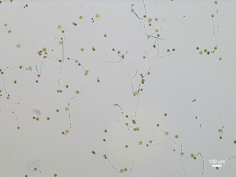
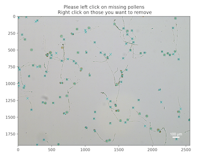
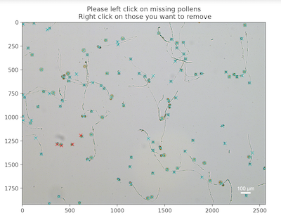

## Click and count objects 

`ClickCount` is a class that allows user interactive to count objects in images.

*class* **plantcv.annotate.ClickCount**(*img*, *figsize*=(12, 6))

- img - Image data
- figsize - Interactive plot figure size (default = (12,6))

### Attributes
**img**: input image.

**points**: a dictionary of coordinates for every class.

**colors**: a dictionary of colors for every class.

**counts**: a dictionary of count for every class.

**figsize**: figure size.

**events**: a list of events.

**label**: current label.

**color**: current color.

**view_all**: a flag indicating whether or not view all labels.

**fig**: matplotlib figure.

**ax**: matplotlib axis.

**p_not_current**: a list of matplotlib patches that are not current label.

### Methods
**import_coords(*coords*, *label*="total")**

Import coordinates from a list of coordinates.

- Parameters:
    - coords - a list of available coordintes.
    - label - class label for imported coordinates. By default `label="total`.

**view(*label*="total", *color*="c", *view_all*=False)**

View marked image, and update markers if needed.

- Parameters:
    - label - class label to show on the marked image. By default `label="total`.
    - color - desired color to show the class. By default `color="c"`.
    - view_all - a flag indicating whether to show markers for all classes or not. 
  
**save_coords(*coord_file*)**

Save the collected coordinates to a JSON file.

- Parameters:
    - coord_file - (json) file name to save the coordinates of collected points. 

**onclick(*event*)**

Handles mouse click events.


- **Example use:**
    - Below
- **Note**: used in Jupyter notebook.

**Input image**



**Mask of automated detected objects**


```python
# include the line of code below to allow interactive activities
%matplotlib widget

from plantcv import plantcv as pcv
# initialization
counter = pcv.annotate.ClickCount(img)
# import coordinates (if available)
counter.import_coords(coords, label="total")
# view "total" class
counter.view(label="total", color="c", view_all=True)
# view "c1" class
counter.view(label="c1", color="r", view_all=True)

```

**View markers for `total` class**



(When interactivity is enabled, you can left click to add markers for the class, or right click to remove markers)

**View markers for `c1` class**



**Source Code:** [Here](https://github.com/danforthcenter/plantcv/blob/master/plantcv/plantcv/annotate/classes.py)
