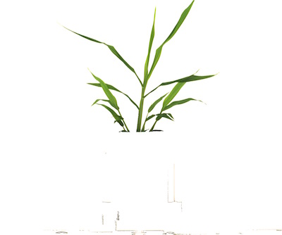
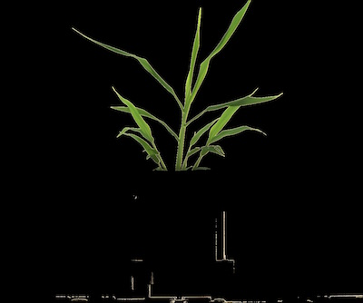

## Apply Mask

Apply binary mask to an image.

**plantcv.apply_mask**(*rgb_img, mask, mask_color*)

**returns** masked image

- **Parameters:**
    - rgb_img - RGB image data
    - mask - Binary mask image data
    - mask_color - 'white' or 'black'
- **Context:**
    - Apply a binary image mask over a grayscale or RGB image. Useful for separating plant and background materials.
- **Example use:**
    - [Use In VIS Tutorial](vis_tutorial.md)
    - [Use In NIR Tutorial](nir_tutorial.md)
    - [Use In PSII Tutorial](psII_tutorial.md)

**Original RGB image**


**Mask image**


```python

from plantcv import plantcv as pcv

# Set global debug behavior to None (default), "print" (to file), or "plot" (Jupyter Notebooks or X11)

pcv.params.debug = "print"

# Apply binary 'white' mask over an image. 
masked_image = pcv.apply_mask(img, mask, 'white')
```

**White-masked image**



```python

from plantcv import plantcv as pcv

# Set global debug behavior to None (default), "print" (to file), or "plot" (Jupyter Notebooks or X11)

pcv.params.debug = "print"

# Apply binary 'black' mask over an image.
masked_image = pcv.apply_mask(img, mask, 'black')
```
  
**Black-masked image**


