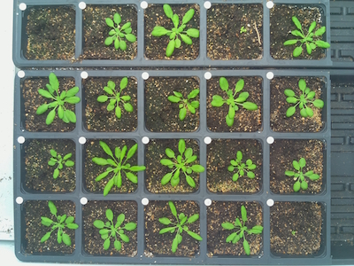
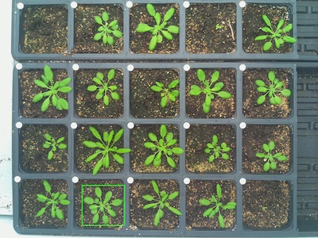
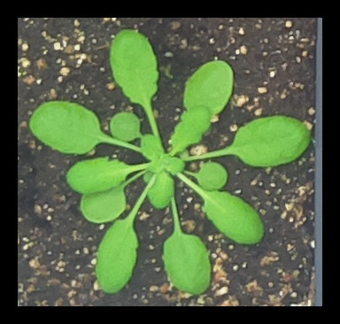
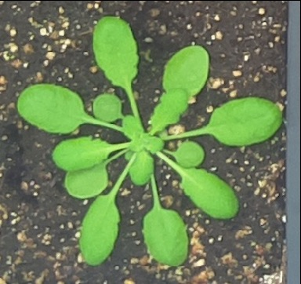

## Auto Crop

Crops image to an object and allows user to specify image padding (if desired)

**plantcv.auto_crop**(*img, mask, padding_x=0, padding_y=0, color='black'*)

**returns** image after cropping

- **Parameters:**
    - img - RGB or grayscale image data
    - mask - Binary mask image data
    - padding_x - integer or tuple to add padding the x direction (default padding_x=0)
    - padding_y - integer or tuple to add padding the y direction (default padding_y=0)
    - color - either 'black' (default), 'white', or 'image'
- **Context:**
    - Crops image to object
    
**Input image**



```python

from plantcv import plantcv as pcv

# Set global debug behavior to None (default), "print" (to file), 
# or "plot" (Jupyter Notebooks or X11)

pcv.params.debug = "plot"

# Crop image
crop_img = pcv.auto_crop(img=rgb_img, mask=bin_mask, padding_x=20, padding_y=20, color='black')

crop_img2 = pcv.auto_crop(img=rgb_img, mask=bin_mask, padding_x=20, padding_y=20, color='image')

```

**Debug Auto Crop Images**







**Source Code:** [Here](https://github.com/danforthcenter/plantcv/blob/main/plantcv/plantcv/auto_crop.py)
