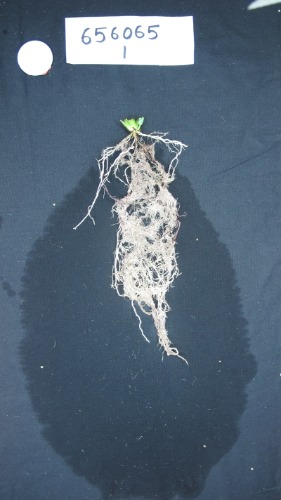
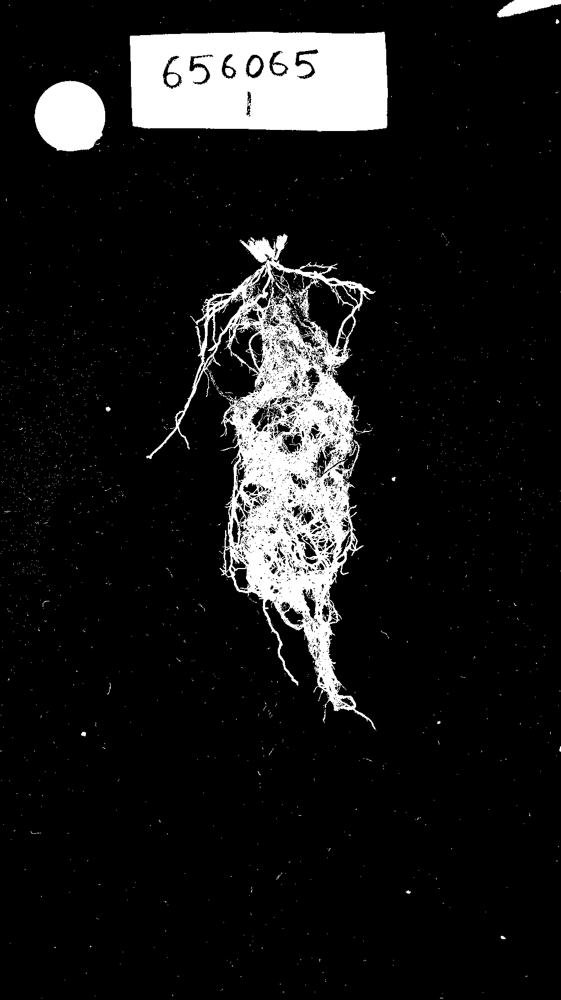

## Background Subtraction

Creates a binary image from a background subtraction of the foreground using `cv2.BackgroundSubtractorMOG2()`.
The binary image returned is a mask that should contain mostly foreground pixels.
The background image should be the same background as the foreground image except not containing the object of interest.

Images must be of the same size and type.
If not, larger image will be taken and downsampled to smaller image size.
If they are of different types, an error will occur.
Requires cv2 version 3.0+

**plantcv.background_subtraction(*foreground_image, background_image*)**

**returns** foreground mask

- **Parameters**
    - foreground_image - RGB or grayscale image object
	- background_image - RGB or grayscale image object
- **Context:**
    - Used to extract object from foreground image containing it and background image without it.
	- E.g. A picture of a pot and the background and a picture of the plant, pot, and same background. Preferably taken from same background.
- **Example use:**
    - [NIR tutorial](nir_tutorial.md)
    - See below.

**Foreground Image**



**Background Image**


```python

from plantcv import plantcv as pcv

# Set global debug behavior to None (default), "print" (to file), or "plot" (Jupyter Notebooks or X11)

pcv.params.debug = "print"

# Create a foreground mask from both images using cv2.BackgroundSubtractorMOG2().
fgmask = pcv.background_subtraction(foreground_image, background_image)
```

**Foreground Mask**


