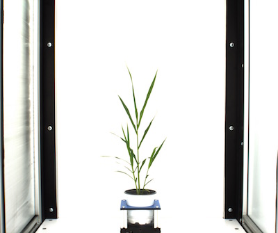
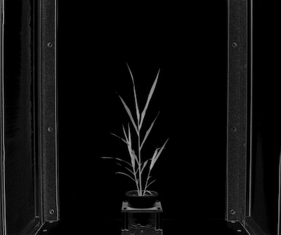
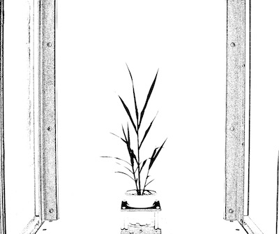

## Binary Threshold

Creates a binary image from a gray image based on the threshold values. 
The object target can be specified as dark or light.

**plantcv.threshold.binary**(*gray_img, threshold, max_value, object_type="light"*)

**returns** thresholded/binary image

- **Parameters:**
    - gray_img - Grayscale image data
    - threshold - Threshold value (0-255)
    - max_value - Value to apply above threshold (255 = white)
    - object_type - "light" or "dark" (default: "light"). If object is lighter than the background then standard 
                    thresholding is done. If object is darker than the background then inverse thresholding is done.
- **Context:**
    - Used to help differentiate plant and background
- **Example use:**
    - [Use In VIS Tutorial](tutorials/vis_tutorial.md)
    - [Use In NIR Tutorial](tutorials/nir_tutorial.md)
    - [Use In PSII Tutorial](tutorials/psII_tutorial.md)
    
**Original image**



**Grayscale image (saturation channel)**



```python

from plantcv import plantcv as pcv

# Set global debug behavior to None (default), "print" (to file), 
# or "plot" (Jupyter Notebooks or X11)

pcv.params.debug = "print"

# Create binary image from a gray image based on threshold values, 
# targeting light objects in the image.
threshold_light = pcv.threshold.binary(gray_img=gray_img, threshold=36, max_value=255, object_type='light')

```

**Thresholded image**


```python

# Create binary image from a gray image based on threshold values, 
# targeting dark objects in the image.
threshold_dark = pcv.threshold.binary(gray_img=gray_img, threshold=36, max_value=255, object_type='dark')

```

**Thresholded image (inverse)**



**Source Code:** [Here](https://github.com/danforthcenter/plantcv/blob/master/plantcv/plantcv/threshold/threshold_methods.py)
