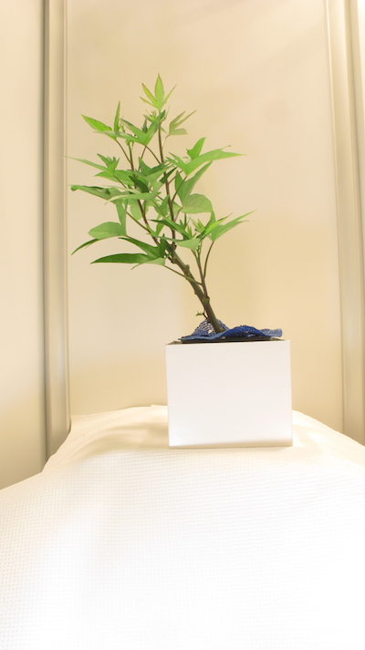
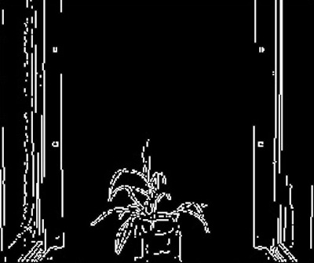
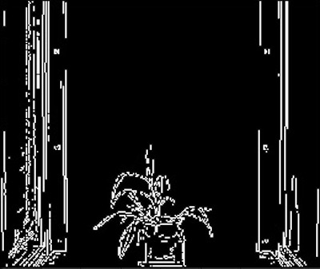
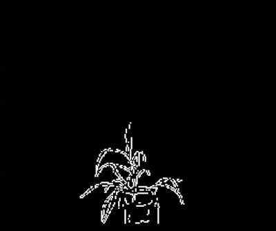

## Canny Edge Detection

Creates a binary image from an RGB or grayscale image using a Canny filter from [skimage](http://scikit-image.org/docs/dev/index.html).


**plantcv.canny_edge_detect(*img, sigma=1.0, low_thresh=None, high_thresh=None, thickness=1, mask=None, mask_color=None, use_quantiles=False*)**

**returns** binary image

- **Parameters:**
    - img - RGB or grayscale image data
    - sigma - Optional standard deviation of the Gaussian filter
    - low_thresh - Optional lower bound for hysteresis thresholding (linking edges). If None (default) then low_thresh is set to
                   10% of the image's max
    - high_thresh - Optional upper bound for hysteresis thresholding (linking edges). If None (default) then high_thresh is set
                    to 20% of the image's max
    - thickness - Optional integer thickness of the edges, default thickness=1
    - mask - Optional mask to limit the application of Canny to a certain area, takes a binary img.
    - mask_color - Color of the mask provided; either None (default), 'white', or 'black' (cannot be None if mask is provided)
    - use_quantiles - Default is False, if True then treat low_thresh and high_thresh as quantiles of the edge magnitude
                    image, rather than the absolute edge magnitude values. If True then thresholds must be within the range `[0, 1]`.

- **Context:**
    - Edge filter using the Canny algorithm
- **Example use:**
    - [Interactive Documentation](https://mybinder.org/v2/gh/danforthcenter/plantcv-binder.git/master?filepath=notebooks%2Fthreshold.ipynb)

**Original image**



```python

from plantcv import plantcv as pcv
from skimage.feature import greycomatrix, greycoprops
from scipy.ndimage import generic_filter
import numpy as np
import cv2

# Set global debug behavior to None (default), "print" (to file), or "plot" (Jupyter Notebooks or X11)

pcv.params.debug = "print"

# Create binary image of edges.
edges = pcv.canny_edge_detect(img)

# Lower sigma value to pick up more edges
edges2 = pcv.canny_edge_detect(img=img, sigma=0.1)

# Create a mask
masked, bin_img, rect_contour, hierarchy = pcv.rectangle_mask(img, (100,150), (300,325), 'black')

# Find edges within a mask
edges3 = pcv.canny_edge_detect(img=img, mask=bin_img, mask_color='black')
```


**Default Canny Edge Detection**



**Canny Edge Detection, sigma=3**



**Canny Edge Detection with Mask**



