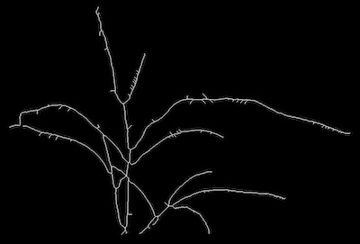
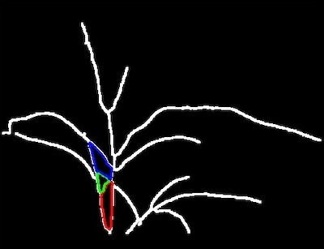

## Check for Cycles

Check for cycles within a skeletonized image. 

**plantcv.morphology.check_cycles**(*skel_img, label=None*)

**returns** debugging cycle image

- **Parameters:**
    - skel_img - Skeleton image (output from [plantcv.morphology.skeletonize](skeletonize.md))
    - label    - Optional label parameter, modifies the variable name of observations recorded. (default = `pcv.params.sample_label`)
- **Context:**
    - Identifies cycles in a skeleton image. 
- **Output data stored:** Data ('num_cycles') automatically gets stored to the [`Outputs` class](outputs.md) when this function is ran. 
    These data can always get accessed during a workflow (example below). For more detail about data output see [Summary of Output Observations](output_measurements.md#summary-of-output-observations)
    

**Reference Image**
 


```python

from plantcv import plantcv as pcv

# Set global debug behavior to None (default), "print" (to file), 
# or "plot" (Jupyter Notebooks or X11)
pcv.params.debug = "plot"
# Optionally, set a sample label name
pcv.params.sample_label = "plant"

# The cycle_img created for debugging purposes allows for line thickness 
# adjustments with the global line thickness parameter. Try setting 
# pcv.params.line_thickness = 8 for thicker lines (default 5)
cycle_img = pcv.morphology.check_cycles(skel_img=skeleton)

# Access data stored out from check_cycles
num_cycles = pcv.outputs.observations['plant']['num_cycles']['value']

```



**Source Code:** [Here](https://github.com/danforthcenter/plantcv/blob/main/plantcv/plantcv/morphology/check_cycles.py)
