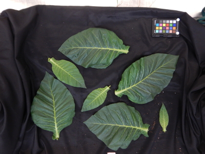
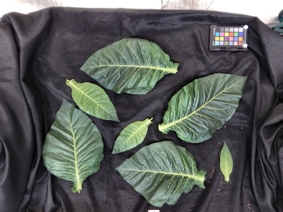
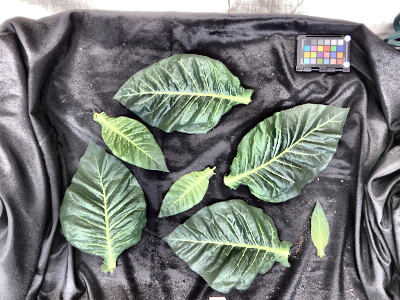

# CLAHE illumination correction

Applies Contrast Limited Adaptive Histogram Equalization (CLAHE) to an image.

**plantcv.transform.clahe**(*img, kernel=8, contrast_threshold=2.0*)

**returns** Image after CLAHE correction. Illumination should be more uniform and the image should appear sharper.

- **Parameters:**
    - img - RGB or grayscale image. An RGB image will be converted to LAB and have the L channel adjusted.
	- kernel - kernel, specified as a shape tuple, integer, or binary numpy array (in which case the array shape will be used, no non-rectangular shapes will be used).
	- contrast_threshold - Limit above which to distribution noise, useful in preventing similar regions of the image from having small noise amplified. Higher values will make for more dramatic, sharper looking changes.

- **Context:**
    - Corrects for non-uniform contrast by tiling the image using the kernel then interpolating the tiles back into one image.


**Input image**



```python
from plantcv import plantcv as pcv

pcv.params.debug = "plot"

corrected_img = pcv.transform.clahe(img, kernel=8, contrast_threshold=2)
```

**Image after correction**




```python
from plantcv import plantcv as pcv

pcv.params.debug = "plot"

corrected_img = pcv.transform.clahe(img, kernel=8, contrast_threshold=10)
```

**Image after stronger correction**



**Source Code:** [Here](https://github.com/danforthcenter/plantcv/blob/main/plantcv/plantcv/transform/clahe.py)

