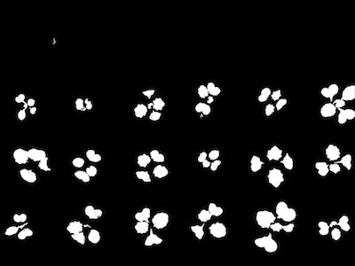

## Cluster Contours

This function take a image with multiple contours and clusters them based on user input of rows and columns

**platncv.cluster_contours**(*img, roi_objects, roi_obj_hierarchy, nrow=1,ncol=1*)

**returns** grouped_contour_indexes, contours, hierarchy

- **Parameters:**
    - img - RGB or grayscale image data for plotting
    - roi_objects - object contours in an image that are needed to be clustered.
    - roi_obj_hierarchy - object hierarchy
    - nrow - approximate number of rows (default nrow=1)
    - ncol - approximate number of columns (default ncol=1)
- **Context:**
    - Cluster contours based on number of approximate rows and columns
- **Example use:**
    - [Use In Multi-Plant Tutorial](multi-plant_tutorial.md)
    

**ROI Objects Output**



```python

from plantcv import plantcv as pcv

# Set global debug behavior to None (default), "print" (to file), or "plot" (Jupyter Notebooks or X11)

pcv.params.debug = "print"

# clusters them based on user input of rows and columns
clusters_i, contours, hierarchy = pcv.cluster_contours(img, roi_objects, roi_obj_hierarchy, 4, 6)
```

**Cluster Contour Image**


