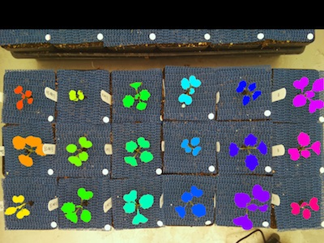

## Cluster Contours and Split Images

This function takes clustered contours and splits them into multiple images, also does a check to make sure that
the number of inputted filenames matches the number of clustered contours.

**plantcv.cluster_contour_splitimg**(*img, grouped_contour_indexes, contours, hierarchy, outdir=None, file=None, filenames=None*)

**returns** output_paths, output_imgs, output_masks

- **Parameters:**
    - img - image data
    - grouped_contour_indexes - output of cluster_contours, indexes of clusters of contours
    - contours - contours to cluster, output of cluster_contours
    - hierarchy - object hierarchy
    - outdir - directory for output images (default outdir=None)
    - file - the name of the input image to use as a base name , output of filename from read_image function (default file=None)
    - filenames - input txt file with list of filenames in order from top to bottom left to right (likely list of genotypes, default filenames=None)
- **Context:**
    - Takes clustered contours and splits them into multiple images.
    - Function input usually comes from the output of the [cluster contours](cluster_contours.md) function.
- **Example use:**
    - [Use In Multi-Plant Tutorial](tutorials/multi-plant_tutorial.md)


**Output of Cluster Contours**




```python

from plantcv import plantcv as pcv

# Set global debug behavior to None (default), "print" (to file), 
# or "plot" (Jupyter Notebooks or X11)

pcv.params.debug = "print"

# Cluster Contours and Split into Separate Images

out = './examples/'
output_path, imgs, masks = pcv.cluster_contour_splitimg(img, clusters_i, contours, 
                                                        hierarchy, out, file, 
                                                        filenames=None)
                                           
```

**Split the Clusters into Separate Images (example of a few images)**


**Source Code:** [Here](https://github.com/danforthcenter/plantcv/blob/master/plantcv/plantcv/cluster_contour_splitimg.py)
