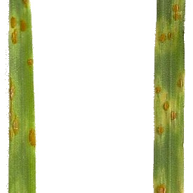

## Segment image by color

Uses a Gaussian Mixture Model or Mini-Batch Kmeans in order to segment an image based on color.
**plantcv.learn.color_clustering_train**(*img, project_name, alias_file*)

**returns** mask of full image with each component listed by color, individual masks for each component.

- **Parameters:**
    - img - RGB image data to be segmented by color. 
    - project_name - This name is used to load the Guassian or Mini-Batch Kmeans model.
    - alias_file - A file of a list of pixel color values to retreive particular clusters.  Default is blank (in which case,
               clusters are simply numbered sequentially).

- **Context:**
    - This function segments an image by color using a Gaussian Mixture or Mini-Batch Kmeans model created by the color_cluster_train function.

**Original image**



```python
from plantcv import plantcv as pcv

# Set global debug behavior to None (default), "print" (to file), 
# or "plot" (Jupyter Notebooks or X11)
pcv.params.debug = "print"

# Segment an image by color based on a previously trained Gaussian Mixture or Mini-Batch Kmeans Model.
obj, mask = pcv.color_clustering_segmentation(img, project_name, alias_file)
```

**Segmented Image**


**Source Code:** [Here](https://github.com/danforthcenter/plantcv/blob/master/plantcv/plantcv/color_clustering_segmentation.py)
