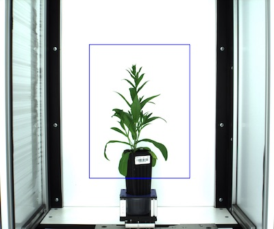
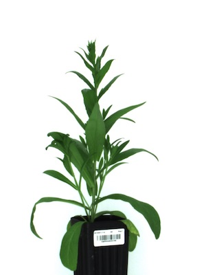

## Crop

Crops image to user specified coordinates 

**plantcv.crop**(*img, x, y, h, w*)

**returns** image after cropping 

- **Parameters:**
    - img - RGB, grayscale, or hyperspectral image data
    - x - Starting X coordinate
    - y - Starting Y coordinate 
    - h - Height 
    - w - Width
- **Context:**
    - Crops image 
    - Allows users to avoid splicing arrays with Python code, although Numpy arrays can be cropped with this method as well.  
    

```python

from plantcv import plantcv as pcv

# Set global debug behavior to None (default), "print" (to file), 
# or "plot" (Jupyter Notebooks or X11)

pcv.params.debug = "plot"

# Crop image
crop_img = pcv.crop(img=img, x=800, y=400, h=1200, w=900)

```

**Debug Crop Image**




**Cropped Image**



**Source Code:** [Here](https://github.com/danforthcenter/plantcv/blob/main/plantcv/plantcv/crop.py)
