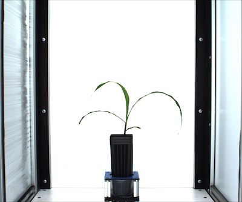
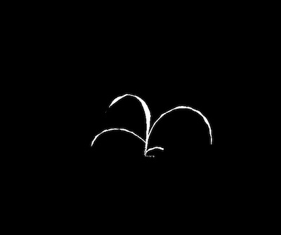
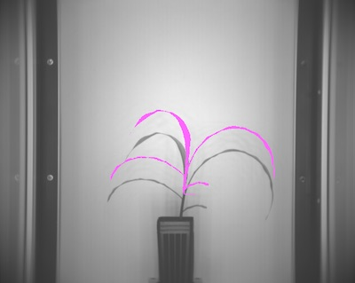
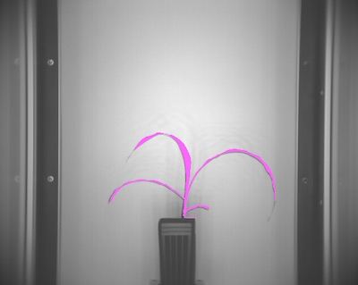

## Crop and position Mask

Takes a binary mask and positions it on another image. 

**plantcv.crop_position_mask**(*img, mask, x, y, v_pos="top", h_pos="right"*)

**returns** newmask

- **Parameters:**
    - img - RGB or grayscale image data for plotting
    - mask - binary image to be used as a mask
    - x - amount to push in the vertical direction
    - y - amount to push in the horizontal direction
    - v_pos -push from the "top" (default) or "bottom" in the vertical direction
    - h_pos - push from the "right" (default) or "left" in the horizontal direction
   
- **Context:**
    - This function is used to position a binary mask over another image.
      The function will also resize the mask so it is the same size as the target image.
   
- **Example use:**
 - [Use in VIS/NIR Tutorial](vis_nir_tutorial.md)

**Original image**



**Original resized mask (using the resize function)**




```python

from plantcv import plantcv as pcv

# Set global debug behavior to None (default), "print" (to file), or "plot" (Jupyter Notebooks or X11)
pcv.params.debug = "print"

# Image not positioned (no adustment)
cropped1 = pcv.crop_position_mask(img, mask, 0, 0, "top", "right")

```

****




```python
from plantcv import plantcv as pcv

# Set global debug behavior to None (default), "print" (to file), or "plot" (Jupyter Notebooks or X11)
pcv.params.debug = "print"

# Image positioned
cropped1 = pcv.crop_position_mask(img, mask, 40, 3, "top", "right")

```

****


