## Custom Range Threshold

Creates a binary image (mask) and a masked image from an RGB or grayscale image based on the user defined threshold values. 
The threshold color-spaces that can be used are grayscale, RGB, HSV, or LAB.

**plantcv.threshold.custom_range**(*img, lower_thresh, upper_thresh, channel='RGB'*)

**returns** mask, masked_img

- **Parameters:**
    - img - RGB image data
    - lower_thresh - List of lower threshold values (0-255)
    - upper_thresh - List of upper threshold values (0-255)
    - channel - Color-space channels of interest (either 'RGB', 'HSV', 'LAB', or 'gray')
- **Context:**
    - Used to help differentiate plant and background
- **Example use:**
    - [Use In NIR Tutorial](tutorials/nir_tutorial.md)

```python

from plantcv import plantcv as pcv

# Set global debug behavior to None (default), "print" (to file), or "plot" (Jupyter Notebooks or X11)

pcv.params.debug = "print"

# Read in the image

img, path, filename = pcv.readimage(filename="rgb_example_img.jpg")

# Create masked image from a color image based RGB color-space and threshold values. 
# for lower and upper_thresh list as: thresh = [red_thresh, green_thresh, blue_thresh]

mask, masked_img = pcv.threshold.custom_range(img=img, lower_thresh=[10,10,10], upper_thresh=[100,255,100], channel='RGB')
```
**Original image (RGB Color-space)**

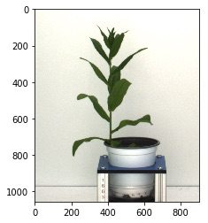

**Masked image (RGB Color-space)**

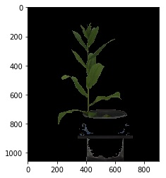

**Mask (RGB Color-space)**

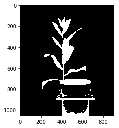

```python
# Read in the image
img, path, filename = pcv.readimage(filename="hsv_example_img.jpg")

# Create masked image from a color image based HSV color-space and threshold values. 
# for lower and upper_thresh list as: thresh = [hue_thresh, saturation_thresh, value_thresh]

mask, masked_img = pcv.threshold.custom_range(img=img, lower_thresh=[30,65,20], upper_thresh=[70,255,220], channel='HSV')

```

**Original image (HSV Color-space)**

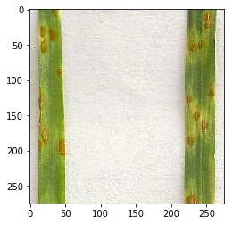

**Masked image (HSV Color-space)**

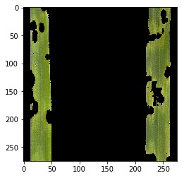

**Mask (HSV Color-space)**

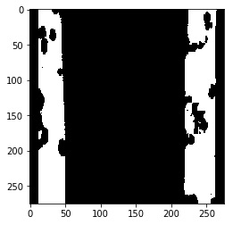

```python

# Read in the image
img, path, filename = pcv.readimage(filename="lab_example_img.jpg")

# Create masked image from a color image based LAB color-space and threshold values.
# for lower and upper_thresh list as: thresh = [L_thresh, A_thresh, B_thresh]
mask, masked_img = pcv.threshold.custom_range(img=img, lower_thresh=[0,0,158], upper_thresh=[255,255,255], channel='LAB')

```

**Original image (LAB Color-space)**

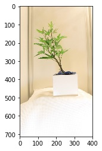

**Masked image (LAB Color-space)**

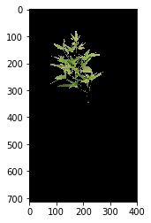

**Mask (LAB Color-space)**

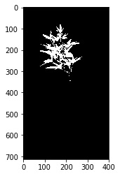


```python

# Read in the image
gray_img, path, filename = pcv.readimage(filename="gray_example_img.jpg")

# Create masked image based grayscale color-space and threshold values. 
# Note that a grayscale image is used. pcv.threshold.custom_range works with both RGB and gray input images. 
mask, masked_img = pcv.threshold.custom_range(img=gray_img, lower_thresh=[39], upper_thresh=[100], channel='gray')

```

**Original image (Grayscale Color-space)**

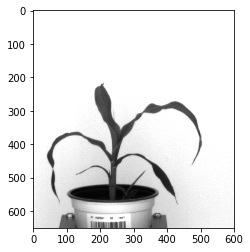

**Masked image (Grayscale Color-space)**


**Mask (Grayscale Color-space)**

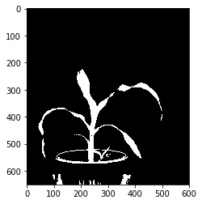

**Source Code:** [Here](https://github.com/danforthcenter/plantcv/blob/master/plantcv/plantcv/threshold/threshold_methods.py)
