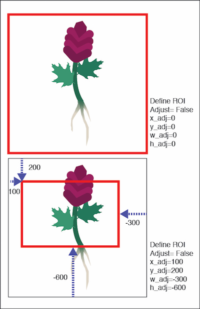
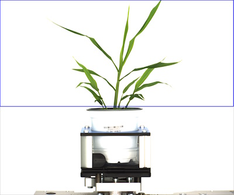
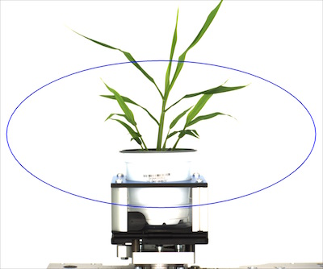

## Define Region of Interest (ROI)

Define a region of interest of the image.

**plantcv.define_roi**(*img, shape, roi=None, roi_input='default', adjust=False, x_adj=0, y_adj=0, w_adj=0, h_adj=0*)

**returns** ROI contour, ROI hierarchy

**Important Note:** In order for downstream detection of objects within a region of interest to 
perform properly ROI must be completely contained within the image.

- **Parameters:**
    - img- img to overlay roi
    - roi- default (None) or user input ROI image (not require to generate an ROI), object area should be white and background should be black, has not been optimized for more than one ROI yet
    - roi_input- type of file roi_base is, either 'binary', 'rgb', or 'default' (no ROI inputted)
    - shape- desired shape of final roi, either 'rectangle', 'circle' or 'ellipse', if  user inputs rectangular roi but chooses 'circle' for shape then a circle is fitted around rectangular roi (and vice versa)
    - adjust- either 'True' or 'False', if 'True' allows user to adjust ROI on the fly
    - x_adj- adjust center along x axis
    - y_adj- adjust center along y axis
    - w_adj- adjust width
    - h_adj- adjust height
- **Context:**
    - Used to define a region of interest in the image.
- **Example use:**
    - [Use In VIS Tutorial](vis_tutorial.md)
    - [Use In PSII Tutorial](psII_tutorial.md)

    

**How to Adjust The ROI**      

    - If -adjust is set to False, then the ROI is the full size of the image (Top)
    - If you would like to adjust the ROI then it is in the context of the full size of the image (see example image, bottom)  
        
  


```python
from plantcv import plantcv as pcv

# Set global debug behavior to None (default), "print" (to file), or "plot" (Jupyter Notebooks or X11)
pcv.params.debug = "print"

# Define region of interest in an image, there is a futher function 'ROI Objects' that allows 
# the user to define if you want to include objects partially inside ROI or if you want to do cut objects to ROI.
roi, roi_hierarchy = pcv.define_roi(img, 'rectangle', roi=None, roi_input='default', adjust=True, x_adj=0, y_adj=0, w_adj=0, h_adj=-925)
```

**Image with rectangular ROI**



```python
from plantcv import plantcv as pcv

# Set global debug behavior to None (default), "print" (to file), or "plot" (Jupyter Notebooks or X11)
pcv.params.debug = "print"

# Define region of interest in an image, there is a futher function 'ROI Objects' that allows 
# the user to define if you want to include objects partially inside ROI or if you want to do cut objects to ROI.
roi, roi_hierarchy = pcv.define_roi(img, 'circle', roi=None, roi_input='default', adjust=True, x_adj=0, y_adj=0, w_adj=0, h_adj=-925)
```

**Image with circular ROI**


```python
from plantcv import plantcv as pcv

# Set global debug behavior to None (default), "print" (to file), or "plot" (Jupyter Notebooks or X11)
pcv.params.debug = "print"

# Define region of interest in an image, there is a futher function 'ROI Objects' that allows
# the user to define if you want to include objects partially inside ROI or if you want to do cut objects to ROI.
roi, roi_hierarchy = pcv.define_roi(img, 'ellipse', roi=None, roi_input='default',  adjust=True, x_adj=0, y_adj=0, w_adj=0, h_adj=-925)
```

**Image with elliptical ROI**


