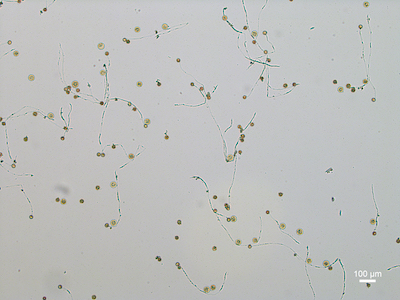

## Detect discs (developing)

Detects disc-shaped regions in a binary image based on eccentricity.
A value of eccentricity between 0 and 1 corresponds to an ellipse.
The closer the value to 0 the closer the shape is to a circle.

**plantcv.detect_discs**(*bin_img, ecc_thresh=0*)

**returns** mask, coordinates of centroids

- **Parameters:**
    - bin_img - Binary image containing the connected regions to consider
    - ecc_thresh - Eccentricity threshold below which a region is detected
- **Context:**
    - Used to isolate disc-shaped objects of interest in a binary image. The output mask can be used for further analysis and the coordinates can be used for object counting along with the class `plantcv.visualize.ClickCount`.
- **Example use:**
    - Below

**Original image**



**Mask generated using binary threshold in the blue channel**
Note: For more on binary thresholding see the the [Use VIS Tutorial](vis_tutorial.md).


```python

from plantcv import plantcv as pcv

# Set global debug behavior to None (default), "print" (to file),
# or "plot"
pcv.params.debug = "plot"

# Apply detect discs to the binary image with an
# eccentricity threshold of 0.9
discs_mask, discs_coor = pcv.detect_discs(bin_img=binary_img, ecc_thresh=0.9)

# Apply detect discs to the binary image with an
# eccentricity threshold of 0.5
discs_mask, discs_coor = pcv.detect_discs(bin_img=binary_img, ecc_thresh=0.5)

```

**Mask of detected objects with eccentricity threshold of 0.9**


**Mask of detected objects with eccentricity threshold of 0.5**


**Source Code:** [Here](https://github.com/danforthcenter/plantcv/blob/master/plantcv/plantcv/detect_discs.py)
