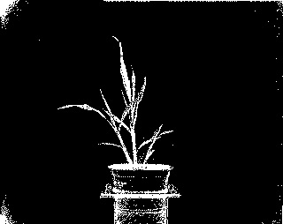
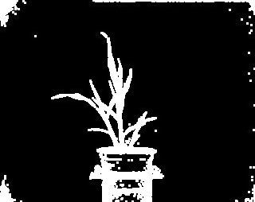

## Dilate

Perform morphological 'dilation' filtering. Adds pixel in center of the kernel if 
conditions set in kernel are true.

**plantcv.dilate**(*gray_img, kernel, i*)

**returns** image after dilation

- **Parameters:**
    - gray_img - Grayscale (usually binary) image data.
    - kernel - An odd integer that is used to build a kernel x kernel matrix using np.ones. Must be greater than 1 to have an effect.
    - i - An integer for number of iterations, i.e. the number of consecutive filtering passes.
- **Context:**
    - Used to perform morphological dilation filtering. Helps expand objects at the edges, particularly after erosion.
- **Example use:**
    - [Use In NIR Tutorial](nir_tutorial.md)
    
**Input grayscale image**



```python

from plantcv import plantcv as pcv

# Set global debug behavior to None (default), "print" (to file), or "plot" (Jupyter Notebooks or X11)
pcv.params.debug = "print"

# Perform dilation
# Results in addition of pixels to the boundary of object
dilate_img = pcv.dilate(gray_img=gray_img, kernel=9, i=1)
```

**Image after dilation**


