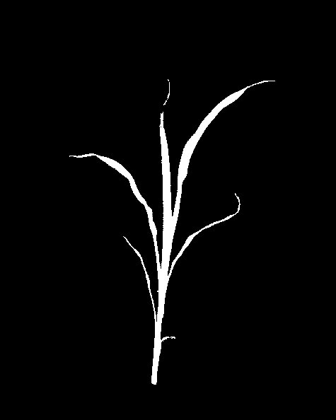
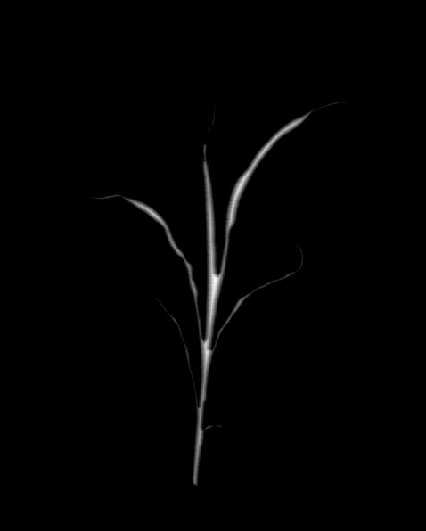

## Distance Transform

Perform distance transform on binary image

**distance_transform**(*img, distanceType, maskSize, device, debug=None*)

**returns** device, distance transformed image normalized between 0 and 1

- **Parameters:**
    - img - Input image
    - distanceType - Type of distance. It can be CV_DIST_L1, CV_DIST_L2 , or CV_DIST_C which are 1,2 and 3 respectively.
    - maskSize - Size of the distance transform mask. It can be 3, 5, or CV_DIST_MASK_PRECISE (the latter option is only supported by the first function). In case of the CV_DIST_L1 or CV_DIST_C distance type, the parameter is forced to 3 because a 3 by 3 mask gives the same result as 5 by 5 or any larger aperture.
    - device - Counter for image processing steps
    - debug - None, "print", or "plot". Print = save to file, Plot = print to screen. Default = None
- **Context:**
    - Used to perform object segmentation via thresholding and marker-aided watershed segmentation.
- **Example use:**
    - See below.
    
**Input binary image**



```python
from plantcv import plantcv as pcv

# Perform dilation
# Results in addition of pixels to the boundary of object
device, distance_transform_img = pcv.distance_transform(mask, 1, 3, device, debug=None)
```

**Image after distance transform**


