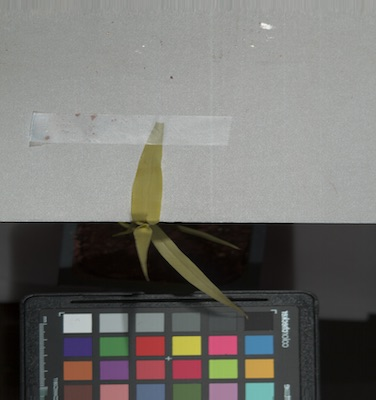

## Extract Index 

This function extracts an index from a `Spectral_data` class instance. There is a parameter to allow some flexibility 
on using wavelengths that are at least close to the wavelength bands require to calculate a specific index. 

**plantcv.hyperspectral.extract_index**(*array, index="NDVI", fudge_factor=20*)

**returns** calculated index array (instance of the `Spectral_data` class)

- **Parameters:**
    - array         - A hyperspectral datacube object, an instance of the `Spectral_data` class
    - index         - Desired index, either "ndvi" for normalized difference vegetation index, "gdvi" for green difference
    vegetation index, or "savi" for soil adjusted vegetation index.
    - fudge_factor  - Amount of flexibility (in nanometers) regarding using wavelengths that are 
    at least close to the wavelength bands require to calculate a specific index

- **Note:**
    - We are adding potential indices as needed by PlantCV contributors, however the functions added to PlantCV are shaped in large part 
    by the end users so please post feature requests (including a specific index), questions, and comments on the 
    [GitHub issues page](https://github.com/danforthcenter/plantcv/issues). 
- **Example use:**
    - Below

**NDVI array image**

**GDVI array image**

**SAVI array image**

