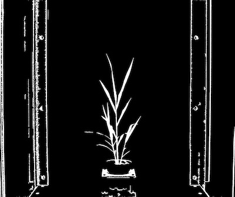

## Fill

Identifies objects and fills objects that are less than specified size

**plantcv.fill**(*bin_img, size*)

**returns** fill_image

- **Parameters:**
    - bin_img - Binary image data
    - size - minimum object area size in pixels (integer), smaller objects will be filled
  - **Context:**
    - Used to reduce image noise
- **Example use:**
    - [Use In VIS Tutorial](vis_tutorial.md)
    - [Use In PSII Tutorial](psII_tutorial.md)


```python

from plantcv import plantcv as pcv

# Set global debug behavior to None (default), "print" (to file), or "plot" (Jupyter Notebooks or X11)
pcv.params.debug = "print"

# Apply fill to a binary image that has had a median blur applied.
# Image mask is the same binary image with median blur.

binary_img = pcv.median_blur(img, 5)

fill_image = pcv.fill(binary_img, 200)
```

**Binary image with [median blur](median_blur.md)**


**Binary image with median blur and fill (200 pixels)**


