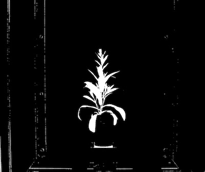
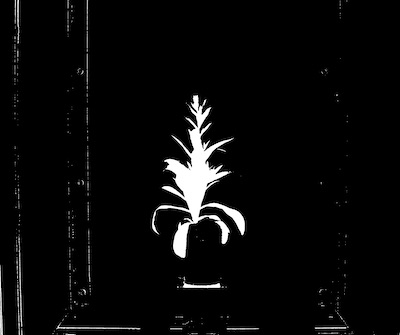

## Fill Holes

Cleans pepper noise (black holes) by doing a flood fill 

**plantcv.fill_holes**(*bin_img*)

**returns** fill_image

- **Parameters:**
    - bin_img - Binary image data
  - **Context:**
    - Used to reduce image noise
- **Example use:**
    - Below

```python

from plantcv import plantcv as pcv

# Set global debug behavior to None (default), "print" (to file), 
# or "plot" (Jupyter Notebooks or X11)
pcv.params.debug = "plot"

# Apply fill holes to a binary image 

fill_image = pcv.fill_holes(bin_img=binary_img)

```

**Binary image**



**Binary image with holes filled**



**Source Code:** [Here](https://github.com/danforthcenter/plantcv/blob/main/plantcv/plantcv/fill_holes.py)
