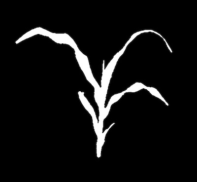
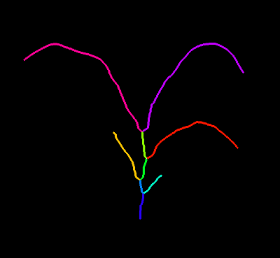
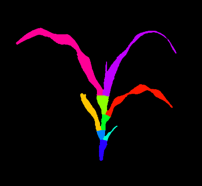

## Fill Segments

Propagate the labels of a segmented skeleton to fill the mask.

**plantcv.morphology.fill_segments**(*mask, objects, stem_objects=None, label="default"*)

**returns** filled_mask

- **Parameters:**
    - mask         - Binary mask
    - objects      - Segment objects (output from either [plantcv.morphology.prune](prune.md),
    [plantcv.morphology.segment_skeleton](segment_skeleton.md), or
    [plantcv.morphology.segment_sort](segment_sort.md)).
    - stem_objects - Optional input for stem objects that will be combined into a single object before filling the mask. 
    - label        - Optional label parameter, modifies the variable name of observations recorded. (default `label="default"`)
- **Context:**
    - Uses the watershed algorithm to fill the mask propagating the objects' labels.
- **Output data stored:** Data ('segment_area') automatically gets stored to the [`Outputs` class](outputs.md) when this function is ran without the `stem_objects` parameter.
    When the optional parameter is utilized then the data variable names will be ('leaf_area') and ('stem_area'). Data sample names are modified with an optional 
    `label` prefix. 
    These data can always get accessed during a workflow (example below). For more detail about data output see [Summary of Output Observations](output_measurements.md#summary-of-output-observations)

**Reference Image:** mask, objects drawn as labels






```python

from plantcv import plantcv as pcv

# Set global debug behavior to None (default), "print" (to file),
# or "plot" (Jupyter Notebooks or X11)
pcv.params.debug = "print"

filled_mask = pcv.morphology.fill_segments(mask=plant_mask, objects=obj, label="default")

# Convert labeled mask to a colorized image
filled_image = pcv.visualize.colorize_label_img(label_img=filled_mask)

# Access data stored out from fill_segments
segments_area = pcv.outputs.observations['default']['segment_area']['value']

```

*Filled Image*



**Source Code:** [Here](https://github.com/danforthcenter/plantcv/blob/master/plantcv/plantcv/morphology/fill_segments.py)
