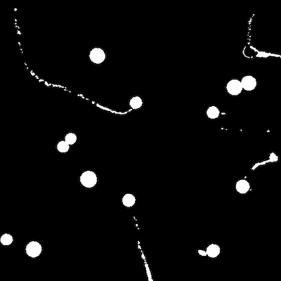
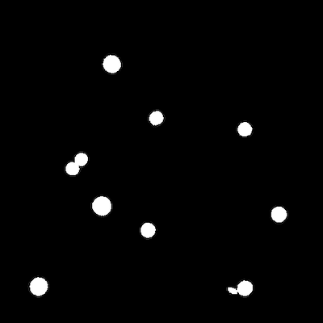

## Dual Object Area Filter

Filters regions of a binary mask that are smaller in area than the `lower_thresh` and any regions larger in
area than the `upper_thresh`. 

**plantcv.filters.obj_area**(*bin_img, upper_thresh, lower_thresh=0*)

**returns** mask

- **Parameters:**
    - bin_img - Binary image containing the connected regions to consider
    - upper_thresh - Upper size threshold, above which a region is removed
    - lower_thresh - (Optional, default = 0) Lower size threshold, below which a region is removed
- **Context:**
    - Used to isolate objects of interest in a binary image that are moderate in object area. The output mask can be used for further analysis.
- **Example use:**
    - Below

**Original image, to be cropped for better viewing**


```python

from plantcv import plantcv as pcv

# Set global debug behavior to None (default), "print" (to file),
# or "plot"
pcv.params.debug = "plot"

# Filter mask to keep moderate sized things
filtered_mask = pcv.filters.obj_area(bin_img=img_l_post, lower_thresh=350, upper_thresh=900)

```

**Mask of detected objects**



**Mask of filtered objects**



**Source Code:** [Here](https://github.com/danforthcenter/plantcv/blob/main/plantcv/plantcv/filters/obj_area.py)
