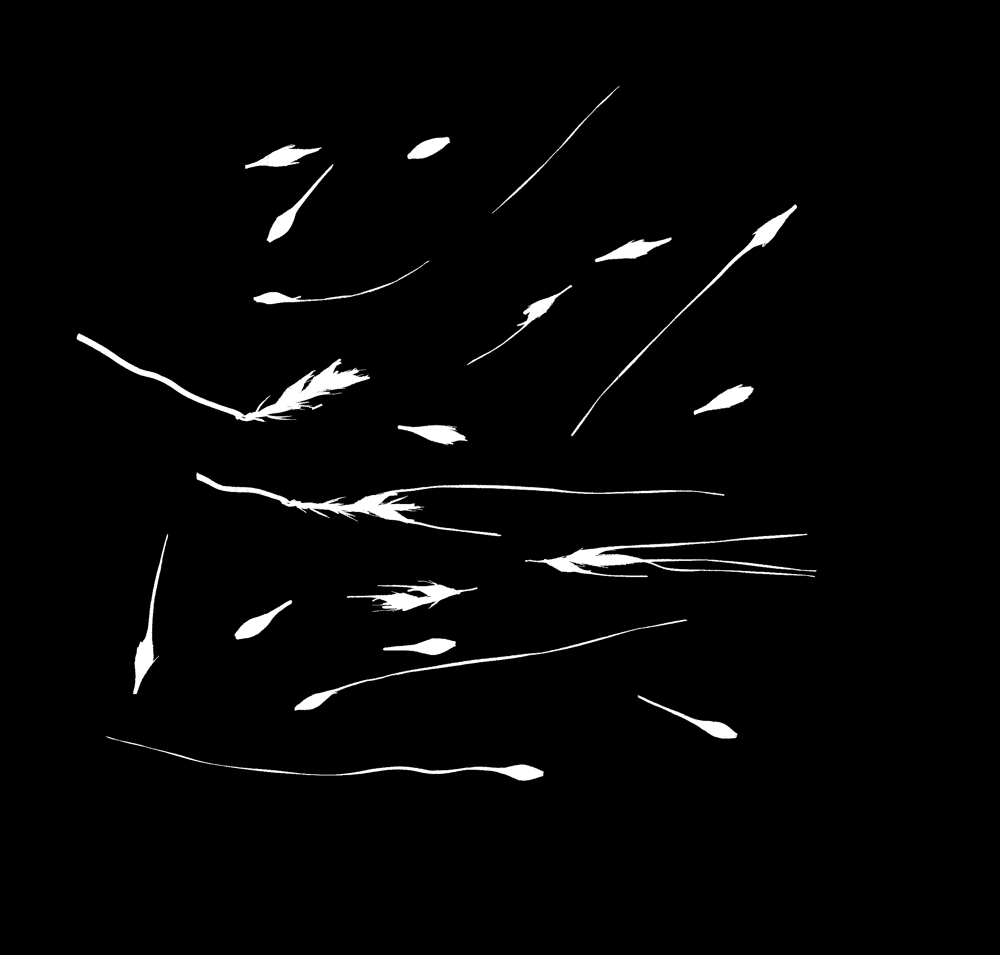
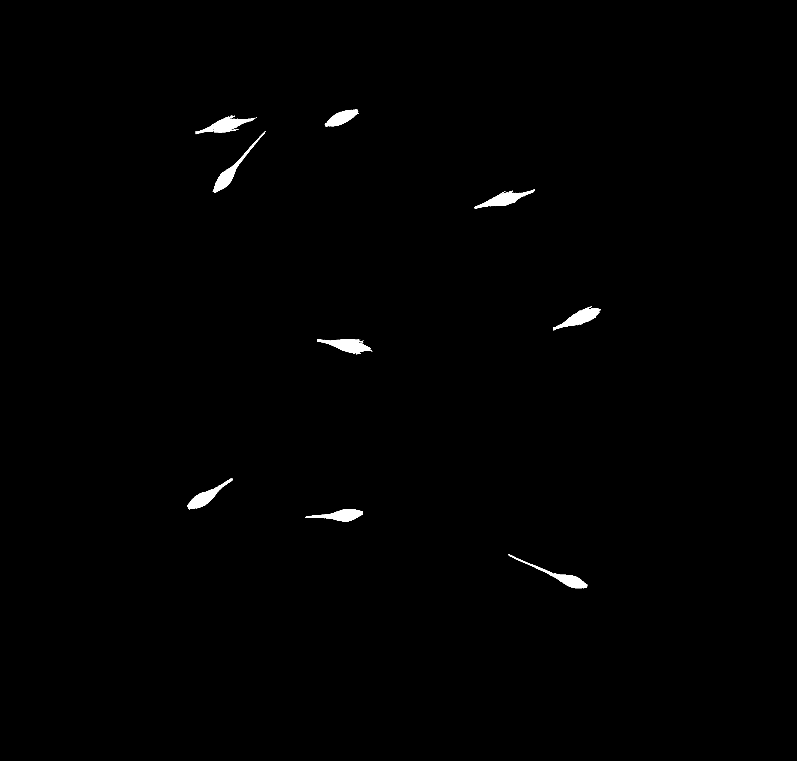
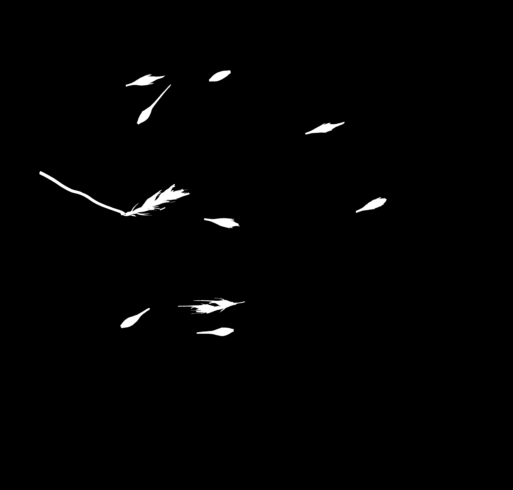
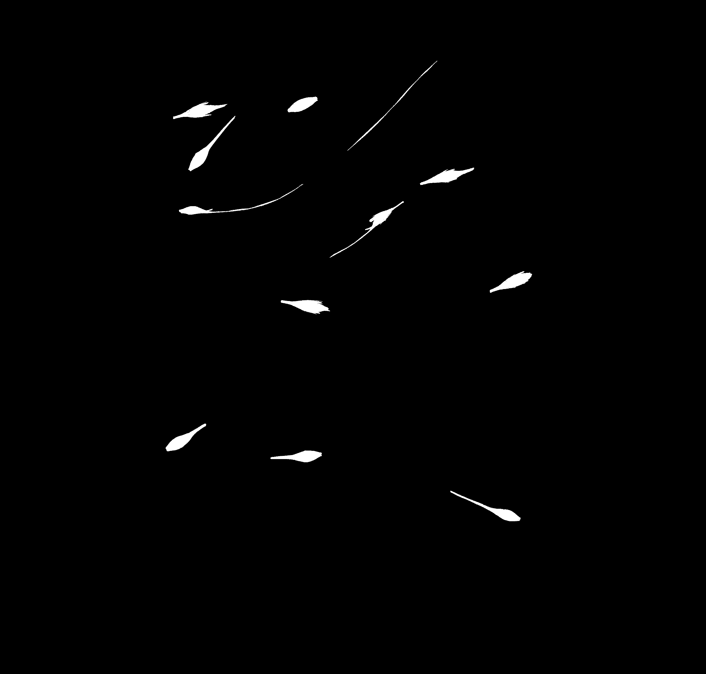

## Filter on calculated object properties

Calculates properties of objects in a binary image. 
Keeps objects that are either above or below a specified threshold for a specified property.
When debug set to "plot," also prints the min, max, and mean of the specified property.

**plantcv.filters.obj_props**(*bin_img, cut_side = "upper", thresh=0, regprop="area", roi=None*)

**returns** filtered_mask

- **Parameters:**
    - bin_img - Binary image containing the connected regions to consider
    - cut_side - "upper" or "lower", side to keep when objects are divided by the "thresh" value
    - thresh - Threshold for keeping objects. 
    - regprop - Which object property to filter on
	- roi - Optional rectangular ROI as returned by [`pcv.roi.rectangle`](roi_rectangle.md) within which to apply this function. (default = None, which uses the entire image)
- **Context:**
    - Used to isolate objects of interest in a binary image based on their features. The output mask can be used for further analysis.
- **Example use:**
    - Below


**Input binary mask**




```python

from plantcv import plantcv as pcv

# Set global debug behavior to None (default), "print" (to file),
# or "plot" 
pcv.params.debug = "plot"

# Apply filter on solidity
filtered_solidity = pcv.filters.obj_props(bin_img=binary_img, cut_side="upper", thresh=0.6, regprop="solidity")

# Apply filter on eccentricity
filtered_eccentricity = pcv.filters.obj_props(bin_img=binary_img, cut_side="lower", thresh=0.99, regprop="eccentricity")

# Apply filter on area
filtered_area = pcv.filters.obj_props(bin_img=binary_img, cut_side="lower", thresh=6000, regprop="area")

```

**Mask of objects with solidity > 0.6**



**Mask of objects with eccentricity < 0.99**



**Mask of objects with area < 6000**



**Source Code:** [Here](https://github.com/danforthcenter/plantcv/blob/main/plantcv/plantcv/filters/obj_props.py)
