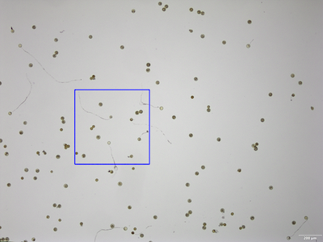
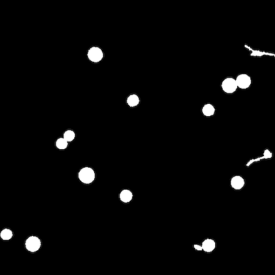
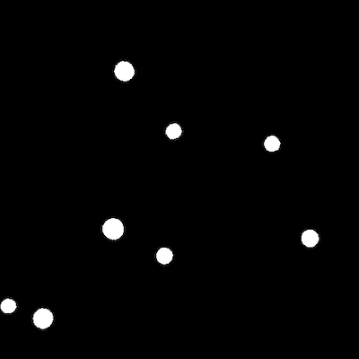

## Filter on object solidity 

Detects more solid regions in a binary image based on calculated solidity (`area / convex_hull_area`).
The closer the value to 1 the closer the shape is to a circle.

**plantcv.filters.solidity**(*bin_img, thresh=0.9*)

**returns** mask

- **Parameters:**
    - bin_img - Binary image containing the connected regions to consider
    - thresh - Solidity threshold below which a region is detected
- **Context:**
    - Used to isolate objects of interest in a binary image based on their structure. The output mask can be used for further analysis.
- **Example use:**
    - Below

**Original image, to be cropped for better viewing**




```python

from plantcv import plantcv as pcv

# Set global debug behavior to None (default), "print" (to file),
# or "plot"
pcv.params.debug = "plot"

# Apply detect discs to the binary image with an
# solidity threshold of 0.9
mask_9 = pcv.filters.solidity(bin_img=binary_img, thresh=0.9)

```

**Mask of detected objects**



**Mask of filtered objects with solidity threshold of 0.9**



**Source Code:** [Here](https://github.com/danforthcenter/plantcv/blob/main/plantcv/plantcv/filters/solidity.py)
