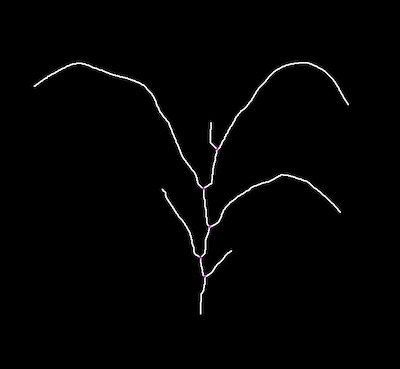
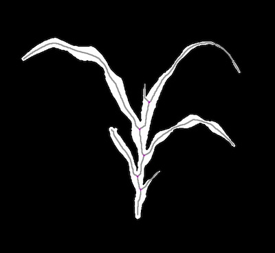

## Find Branch/Junction Points 

Find branch/junction points in a skeletonized image. 

**plantcv.morphology.find_branch_pts**(*skel_img, mask=None, label=None*)

**returns** Binary mask of branch points 

- **Parameters:**
    - skel_img - Skeleton image (output from [plantcv.morphology.skeletonize](skeletonize.md))
    - mask     - Binary mask used for debugging image (optional). If provided the debug image will be overlaid on the mask.
    - label    - Optional label parameter, modifies the variable name of observations recorded. (default = `pcv.params.sample_label`)
- **Context:**
    - Identifies branch/junction points in a skeleton image
    
- **Output data stored:** Data ('branch_pts') 
    automatically gets stored to the [`Outputs` class](outputs.md) when this function is ran. 
    All data stored in the Outputs class gets printed out while running [pcv.outputs.save_results](outputs.md) but
    these data can always get accessed during a workflow. For more detail about data output see 
    [Summary of Output Observations](output_measurements.md#summary-of-output-observations)

**Skeleton Image**


```python

from plantcv import plantcv as pcv

# Set global debug behavior to None (default), "print" (to file), 
# or "plot" (Jupyter Notebooks or X11)
pcv.params.debug = "plot"
# Optionally, set a sample label name
pcv.params.sample_label = "plant"

branch_points_img = pcv.morphology.find_branch_pts(skel_img=skeleton)

# Adjust line thickness with the global line thickness parameter (default = 5),
# and provide binary mask of the plant for debugging. NOTE: the image returned
# will be exactly the same, but the debugging image will look different. 
pcv.params.line_thickness = 2

branch_points_img = pcv.morphology.find_branch_pts(skel_img=skeleton, mask=None)
branch_points_img = pcv.morphology.find_branch_pts(skel_img=skeleton, mask=plant_mask, label="rep1")

```

*Branch Points Image (image getting returned)*


*Debug Image without Mask*



*Debug Image with Mask*



**Source Code:** [Here](https://github.com/danforthcenter/plantcv/blob/main/plantcv/plantcv/morphology/find_branch_pts.py)
