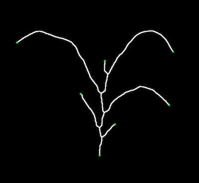

## Find Endpoints/Tips

**plantcv.morphology.*find_tips*(*skel_img, mask=None*)

**returns** Binary mask of endpoints 

- **Parameters:**
    - skel_img - Skeleton image (output from [plantcv.morphology.skeletonize](skeletonize.md))
    - mask - Binary mask used for debugging (optional). If provided the debug image will be overlaid on the mask.
- **Context:**
    - Identifies endpoints/tips in a skeleton image

**Skeleton Image**


```python

from plantcv import plantcv as pcv

# Set global debug behavior to None (default), "print" (to file), 
# or "plot" (Jupyter Notebooks or X11)
pcv.params.debug = "plot"

# Adjust line thickness with the global line thickness parameter (default = 5),
# and provide binary mask of the plant for debugging. NOTE: the image returned
# will be exactly the same, but the debugging image will look different. 
pcv.params.line_thickness = 3

tips_img = pcv.morphology.find_tips(skel_img=skeleton)
tips_img = pcv.morphology.find_tips(skel_img=skeleton, mask=plant_mask)


```

*Tip Points Image (image getting returned)*


*Debug Image without Mask*



*Debug Image with Mask*


