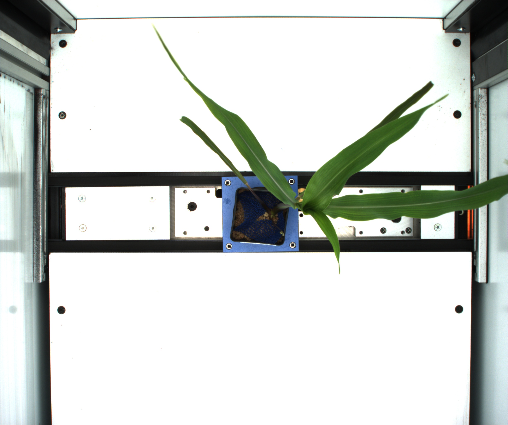
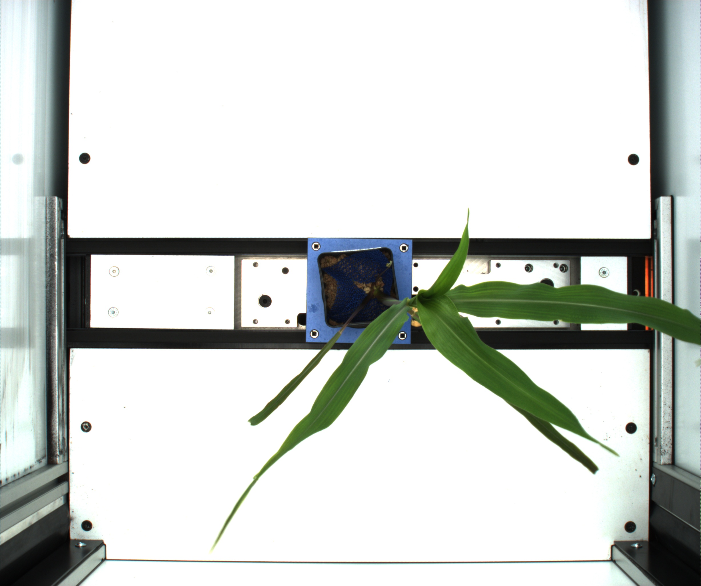
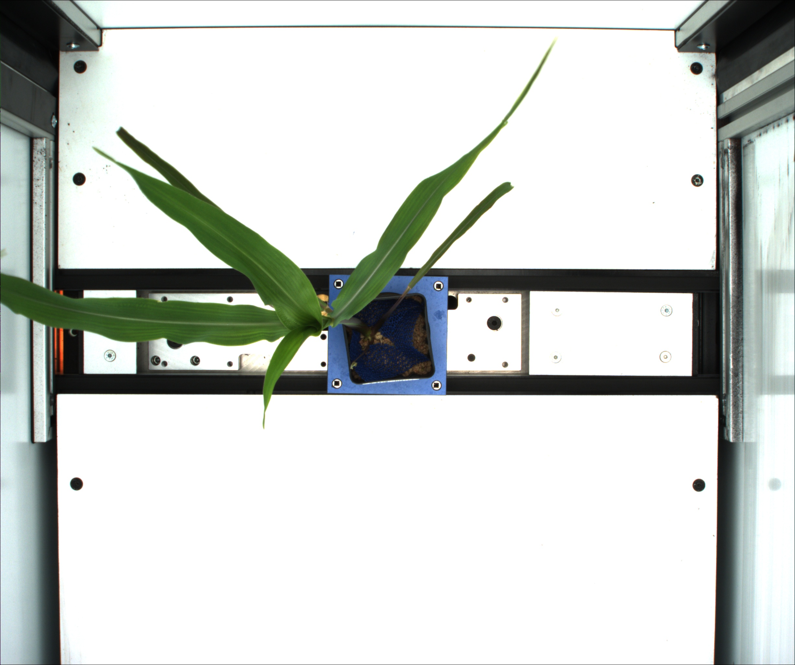

## Flip Image

Flips an image in either the horizontal or vertical direction

**plantcv.flip**(*img, direction*)

**returns** flipped_image

- **Parameters:**
    - img - RGB or grayscale image data
    - direction - the direction you want the image flipped, either 'horizontal' or 'vertical'
- **Context:**
    - Used to flip images when necessary
- **Example use:**
 - flip image horizontally or vertically, rotate function is also available to adjust image positioning.

**Original image**



```python

from plantcv import plantcv as pcv

# Set global debug behavior to None (default), "print" (to file), or "plot" (Jupyter Notebooks or X11)
pcv.params.debug = "print"

# Flip Image Horizontal
flipped= pcv.flip(img, 'horizontal')
```

**Flipped Image**



```python

from plantcv import plantcv as pcv

# Set global debug behavior to None (default), "print" (to file), or "plot" (Jupyter Notebooks or X11)
pcv.params.debug = "print"

# Flip Image Vertical
flipped= pcv.flip(img, 'vertical')
```

**Flipped Image**

