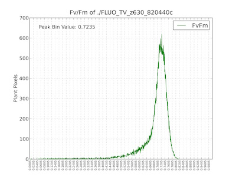
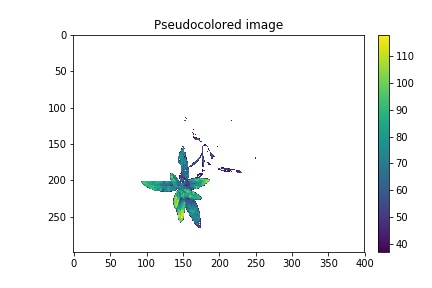

## Analyze PSII Signal

Extract Fv/Fm data of objects.

**plantcv.fluor_fvfm**(*fdark, fmin, fmax, mask, bins=256*)

**returns** Fv/Fm histogram headers, Fv/Fm histogram data, PSII analysis images (Fv image, Fv/Fm histogram)

- **Parameters:**
    - fdark - image object, grayscale
    - fmin - image object  grayscale
    - fmax - image object, grayscale
    - mask - binary mask of selected contours
    - bins - number of grayscale bins (0-256 for 8-bit images and 0 to 65,536), if you would like to bin data, you would alter this number (default bins=256)
- **Context:**
    - Used to extract fv/fm per identified plant pixel.
    - Generates histogram of fv/fm data.
    - Generates fv/fm image.
- **Example use:**
    - [Use In PSII Tutorial](psII_tutorial.md)
    
- **Output Data Units:**
    - Bin-number - number of bins set by user  
    - FV/FM Bins - bin values based on number of bins set by user  
    - FV/FM Histogram - histogram of FV/FM ratio values for object  
    - FV/FM Histogram Peak - bin value of histogram peak (greatest number of pixels)  
    - FV/FM Median - bin value of histogram median  
    - F-Dark Passed QC - Check (True or False) to determine if Fdark image does not have pixel intensity values above 2000. 

**Fdark image**


**Fmin image**


**Fmax image**


```python
from plantcv import plantcv as pcv

# Set global debug behavior to None (default), "print" (to file), or "plot" (Jupyter Notebooks or X11)
pcv.params.debug = "print"

# Analyze Fv/Fm    
 fvfm_header, fvfm_data, fvfm_images = pcv.fluor_fvfm(fdark, fmin, fmax, kept_mask, 256)

# Store the two images
fv_img=fvfm_images[0]
fvfm_hist=fvfm_images[1]

# Plot the histogram
fvfm_hist

 # Pseudocolor the Fv/Fm image
 pseudo_img = pcv.pseudocolor(gray_img=fv_img, mask=kept_mask)
```

**Histogram of Fv/Fm values**



**Pseudocolored output image based on Fv/Fm**



The grayscale Fv/Fm image (returned to analysis_image) can be used with the [pcv.pseudocolor](pseudocolor.md) function
which allows the user to pick a colormap for plotting.
